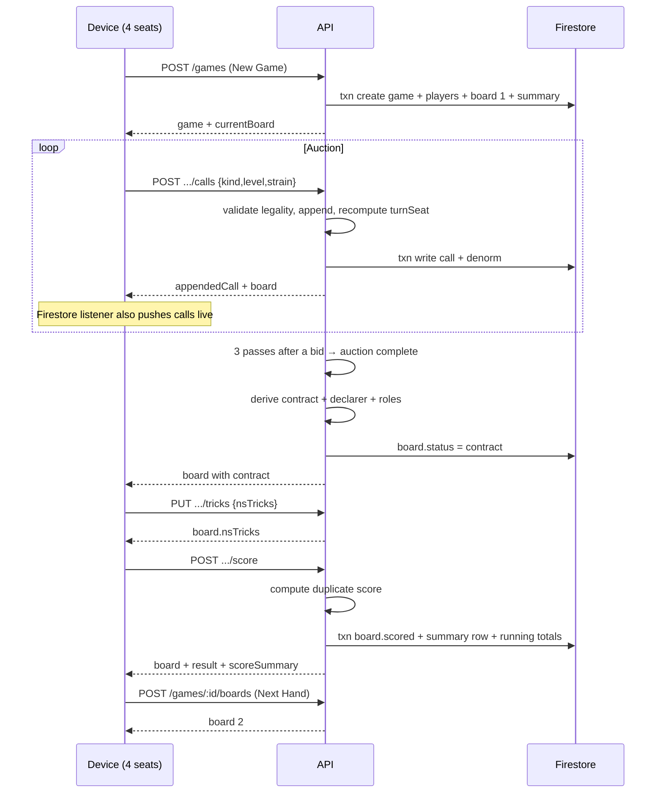
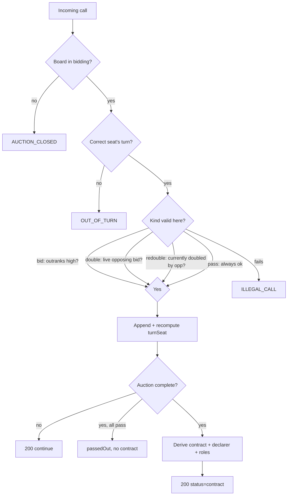

# Bridge Table Companion — API Specification

This document specifies the API supporting the Bridge Table Companion UI. Endpoints are organised around the screens and user actions of the app (New Game → Bidding → Contract → Tricks → Score, plus Settings and Bid History) and back onto the Firestore data model in `DATA_MODEL.md`.

The API enforces all Bridge rules server-side — legal-bid validation, auction completion, declarer derivation, and duplicate scoring — so no client can record an illegal call or a forged score. Clients send *intent* (a call, a trick count); the server returns *truth* (the updated board, the derived contract, the score).

> **Transport.** Specified as REST/JSON for clarity. The natural Firebase implementation is HTTPS Callable Functions (one callable per operation) backed by Firestore transactions, with real-time screens using Firestore listeners directly rather than polling these endpoints.

---

## 1. Conventions

- **Base path:** `/v1`
- **Format:** JSON request and response bodies; UTF-8.
- **Auth:** Bearer token (Firebase Auth ID token) or an anonymous game join token. Sent as `Authorization: Bearer <token>`.
- **IDs:** Opaque strings (`gameId`, `boardId`, `callId`).
- **Seats:** `north` | `east` | `south` | `west`.
- **Timestamps:** ISO 8601 UTC.
- **Idempotency:** Mutating calls accept an optional `Idempotency-Key` header so a retried request (e.g. a double-tap on a flaky connection) can't append a call twice.

### 1.1 Enumerations

| Enum | Values |
|---|---|
| `palette` | `feltGreen` `navyBlue` `highContrast` `warmParchment` |
| `biddingLayout` | `autoRotate` `fourGrids` |
| `gridStyle` | `table` `compact` |
| `vulnerability` | `none` `NS` `EW` `both` |
| `callKind` | `bid` `pass` `double` `redouble` |
| `strain` | `C` `D` `H` `S` `NT` |
| `doubled` | `none` `doubled` `redoubled` |
| `boardStatus` | `bidding` `contract` `tricks` `scored` |
| `gameStatus` | `active` `completed` `abandoned` |

### 1.2 Standard error shape

```json
{
  "error": {
    "code": "ILLEGAL_CALL",
    "message": "2♣ does not outrank the current bid 2♥.",
    "details": { "attempted": { "level": 2, "strain": "C" }, "currentHigh": { "level": 2, "strain": "H" } }
  }
}
```

| HTTP | `code` examples | Meaning |
|---|---|---|
| 400 | `INVALID_BODY`, `ILLEGAL_CALL`, `OUT_OF_TURN`, `AUCTION_CLOSED`, `INVALID_TRICKS` | Request understood but rejected by rules/validation. |
| 401 | `UNAUTHENTICATED` | Missing/expired token. |
| 403 | `FORBIDDEN_SEAT`, `FORBIDDEN_GAME` | Caller may not act on this game/seat. |
| 404 | `GAME_NOT_FOUND`, `BOARD_NOT_FOUND` | Unknown id. |
| 409 | `STATE_CONFLICT`, `NOTHING_TO_UNDO` | Operation invalid for current state. |
| 429 | `RATE_LIMITED` | Too many requests. |
| 500 | `INTERNAL` | Server fault. |

---

## 2. Endpoint map (by screen)

```mermaid
flowchart TD
    NG[New Game screen] --> P1[POST /games]
    B[Bidding screen] --> P2[POST /games/:id/boards/:bid/calls]
    B --> P3[DELETE .../calls/last  undo]
    B --> R1[listen: board + calls]
    C[Contract screen] --> R2[GET board]
    C --> P4[POST .../advance  to tricks/next]
    T[Tricks screen] --> P5[PUT .../tricks]
    T --> P6[POST .../score]
    SC[Score screen] --> R3[GET /games/:id/score-summary]
    SC --> P7[POST /games/:id/boards  next hand]
    SC --> P8[POST /games/:id/complete  new game]
    BH[Bid History] --> R4[GET board auction]
    ST[Settings] --> P9[PATCH /games/:id/settings]
```



---

## 3. Resources & endpoints

### 3.1 Games

#### `POST /v1/games` — Create a game (New Game → Start)
Creates the game, four seats, the running-score summary, and board 1 in one transaction.

**Request**
```json
{
  "trackVulnerability": true,
  "calculateScore": true,
  "settings": {
    "palette": "feltGreen",
    "biddingLayout": "autoRotate",
    "gridStyle": "table",
    "animations": true,
    "sound": false
  },
  "players": [
    { "seat": "north", "displayName": "Gran" },
    { "seat": "east",  "displayName": "Me" },
    { "seat": "south", "displayName": "Bro" },
    { "seat": "west",  "displayName": "Guest" }
  ]
}
```

**Response `201`**
```json
{
  "gameId": "g_abc123",
  "status": "active",
  "currentBoard": {
    "boardId": "b_0001",
    "boardNumber": 1,
    "dealer": "north",
    "vulnerability": "none",
    "status": "bidding",
    "turnSeat": "north",
    "callCount": 0
  },
  "joinToken": "jt_..."
}
```

Notes: `dealer` and `vulnerability` are derived server-side from `boardNumber` (dealer cycles N→E→S→W; vulnerability follows the 16-board cycle). Player names are optional.

#### `GET /v1/games/{gameId}` — Game state
Returns settings, players, and a pointer to the current board.

**Response `200`**
```json
{
  "gameId": "g_abc123",
  "status": "active",
  "trackVulnerability": true,
  "calculateScore": true,
  "settings": { "palette": "feltGreen", "biddingLayout": "autoRotate", "gridStyle": "table", "animations": true, "sound": false },
  "players": [ { "seat": "north", "displayName": "Gran", "pair": "NS" }, "..." ],
  "currentBoardId": "b_0007",
  "currentBoardNumber": 7
}
```

#### `PATCH /v1/games/{gameId}/settings` — Update settings (Settings overlay)
Partial update; any subset of settings fields.

**Request**
```json
{ "palette": "highContrast", "biddingLayout": "fourGrids", "animations": false }
```
**Response `200`** — the updated settings block.

Validation: `biddingLayout: fourGrids` and `gridStyle: table` are rejected with `INVALID_BODY` when the client declares a phone form factor (`X-Device: mobile`), mirroring the UI rule that only Compact fits a phone.

#### `POST /v1/games/{gameId}/complete` — End game (New Game from Score)
Sets `status` to `completed`. Returns final totals.

---

### 3.2 Boards

#### `POST /v1/games/{gameId}/boards` — Start the next board (Next Hand)
Creates the next board (increments `boardNumber`, derives dealer/vulnerability), sets it current.

**Response `201`** — the new board object (same shape as `currentBoard` above).

#### `GET /v1/games/{gameId}/boards/{boardId}` — Board state
Single read that serves the Bidding, Contract, and Tricks screens. Includes the denormalised auction so Bid History needs no extra call.

**Response `200`**
```json
{
  "boardId": "b_0007",
  "boardNumber": 7,
  "dealer": "south",
  "vulnerability": "both",
  "status": "contract",
  "turnSeat": null,
  "passedOut": false,
  "contract": { "level": 4, "strain": "H" },
  "declarer": "south",
  "doubled": "doubled",
  "nsTricks": 0,
  "scoreNS": 0,
  "scoreEW": 0,
  "callCount": 8,
  "roles": {
    "south": { "role": "declarer" },
    "north": { "role": "dummy" },
    "west":  { "role": "defender", "note": "openingLead" },
    "east":  { "role": "defender" }
  },
  "auction": [
    { "seq": 0, "seat": "south", "kind": "bid", "level": 1, "strain": "H" },
    { "seq": 1, "seat": "west",  "kind": "pass" },
    "..."
  ]
}
```

`roles` is computed server-side (declarer, dummy = partner, opening lead = left of declarer) so the Contract screen renders directly.

#### `GET /v1/games/{gameId}/boards` — List boards
For the score sheet fallback / navigation. Supports `?status=` filter. Ordered by `boardNumber`.

---

### 3.3 Bidding (calls)

#### `POST /v1/games/{gameId}/boards/{boardId}/calls` — Make a call
The core action. The server validates legality **for the seat whose turn it is**, appends the call, recomputes `turnSeat`, and — if the auction is now complete — derives the contract and advances `status`.

**Request**
```json
{ "kind": "bid", "level": 2, "strain": "S" }
```
(For `pass`/`double`/`redouble`, omit `level`/`strain`.)

**Response `200` — auction continues**
```json
{
  "appendedCall": { "callId": "c_09", "seq": 8, "seat": "east", "kind": "bid", "level": 2, "strain": "S" },
  "board": { "boardId": "b_0007", "status": "bidding", "turnSeat": "south", "callCount": 9 }
}
```

**Response `200` — auction completes**
```json
{
  "appendedCall": { "callId": "c_10", "seq": 9, "seat": "south", "kind": "pass" },
  "board": {
    "boardId": "b_0007", "status": "contract", "turnSeat": null,
    "passedOut": false,
    "contract": { "level": 2, "strain": "S" }, "declarer": "east", "doubled": "none"
  }
}
```

**Errors**
- `ILLEGAL_CALL` — bid doesn't outrank current high; double without a live opposing bid; redouble when not doubled, etc.
- `AUCTION_CLOSED` — board no longer in `bidding`.
- `OUT_OF_TURN` — `seat` supplied doesn't match `turnSeat` (when seat is asserted by the client).

> The legal-call set the UI needs to enable/disable buttons can be requested via the board's `legalCalls` projection (see §3.4) so the client never has to embed rule logic.

#### `DELETE /v1/games/{gameId}/boards/{boardId}/calls/last` — Undo (Back)
Pops the most recent call, decrements `callCount`, recomputes `turnSeat` and the denormalised auction. If completing the auction is being undone, `status` reverts to `bidding` and the derived contract is cleared.

**Response `200`**
```json
{ "removedSeq": 9, "board": { "status": "bidding", "turnSeat": "south", "callCount": 9 } }
```
**Error** `NOTHING_TO_UNDO` (409) when the auction is empty.

---

### 3.4 Legal-call projection (UI button states)

#### `GET /v1/games/{gameId}/boards/{boardId}/legal-calls`
Returns which calls are currently legal, so the Bidding grid can enable/disable buttons without client-side rule logic. (Often delivered inline on the board read; exposed here for completeness.)

**Response `200`**
```json
{
  "turnSeat": "south",
  "bids": [
    { "level": 2, "strain": "S", "legal": true },
    { "level": 2, "strain": "H", "legal": false },
    "... all 35 level/strain combinations ..."
  ],
  "double": false,
  "redouble": false,
  "pass": true
}
```

---

### 3.5 Tricks & scoring

#### `PUT /v1/games/{gameId}/boards/{boardId}/tricks` — Set N/S trick count
Idempotent set (not increment), so the two-sided counter on either side of the table converges on one value.

**Request**
```json
{ "nsTricks": 9 }
```
**Response `200`**
```json
{ "board": { "boardId": "b_0007", "nsTricks": 9, "status": "tricks" } }
```
**Error** `INVALID_TRICKS` when outside 0–13.

#### `POST /v1/games/{gameId}/boards/{boardId}/score` — Confirm & compute score (Add Score)
Computes duplicate score from contract + tricks + vulnerability, writes it to the board, appends a row to the score summary, and updates running totals — all in one transaction.

**Response `200`**
```json
{
  "board": { "boardId": "b_0007", "status": "scored", "scoreNS": 0, "scoreEW": 670, "nsTricks": 9 },
  "result": "made+1",
  "scoreSummary": { "runningNS": 1240, "runningEW": 980, "boardsPlayed": 7 }
}
```

`result` is a derived label: `made`, `made+N`, or `downN`. For a passed-out board, scoring is a no-op that records a zero row.

---

### 3.6 Score summary (Score screen)

#### `GET /v1/games/{gameId}/score-summary`
One read renders the whole dual-readable score sheet.

**Response `200`**
```json
{
  "runningNS": 1240,
  "runningEW": 980,
  "leader": "NS",
  "boardsPlayed": 7,
  "rows": [
    {
      "boardNumber": 1, "contract": { "level": 3, "strain": "NT" },
      "declarer": "north", "doubled": "none", "result": "made",
      "scoreNS": 400, "scoreEW": 0, "runningAfter": 400, "boardId": "b_0001"
    },
    "..."
  ]
}
```

---

### 3.7 Bid History

The auction is already on the board read (`auction[]`, §3.2) and on every score row (`boardId` → board fetch). No dedicated endpoint is required; `GET board` serves both the live (Contract screen) and historical (score row) Bid History views.

---

## 4. Sequence — a single board



---

## 5. Real-time vs request/response

Two of the screens are shared live across up to four clients on one device; they should **listen** rather than poll.

| Screen | Recommended mechanism |
|---|---|
| Bidding | Firestore listener on `board` + `calls` (live turn + auction); calls submitted via `POST .../calls`. |
| Contract | Listener on `board` (so all sides update the instant the auction closes). |
| Tricks | Listener on `board` (the two-sided counter stays in sync); set via `PUT .../tricks`. |
| Score | Listener on `score-summary` doc. |
| New Game / Settings | Plain request/response. |

The REST endpoints remain the **write path and the rules authority**; listeners are the **read path** for live screens. This keeps Bridge logic centralised while giving every seat an instantly consistent view.

---

## 6. Validation rules enforced server-side



These mirror the prototype's engine exactly: legal-bid ranking (♣<♦<♥<♠<NT), double/redouble eligibility, completion after three passes following a bid (or four passes from the open), declarer = first of the winning pair to name the final strain, and full duplicate scoring with vulnerability, slam bonuses, and doubled penalties.

---

## 7. Endpoint summary

| Method | Path | Screen / action |
|---|---|---|
| POST | `/v1/games` | New Game → Start |
| GET | `/v1/games/{gameId}` | Resume / load game |
| PATCH | `/v1/games/{gameId}/settings` | Settings overlay |
| POST | `/v1/games/{gameId}/complete` | New Game (end session) |
| POST | `/v1/games/{gameId}/boards` | Next Hand |
| GET | `/v1/games/{gameId}/boards/{boardId}` | Bidding / Contract / Tricks / Bid History |
| GET | `/v1/games/{gameId}/boards` | Board list |
| POST | `/v1/games/{gameId}/boards/{boardId}/calls` | Make a call |
| DELETE | `/v1/games/{gameId}/boards/{boardId}/calls/last` | Undo (Back) |
| GET | `/v1/games/{gameId}/boards/{boardId}/legal-calls` | Bidding grid button states |
| PUT | `/v1/games/{gameId}/boards/{boardId}/tricks` | Tricks counter |
| POST | `/v1/games/{gameId}/boards/{boardId}/score` | Add Score |
| GET | `/v1/games/{gameId}/score-summary` | Score screen |
