# Bridge Table Companion — Architecture Document

## 0. About this document

This describes the technical architecture of the Bridge Table Companion: an offline-first, table-centre Bridge bidding and scoring aid. The current build is **offline-only**: a React app whose rules and scoring run on-device in TypeScript, persisting to the browser. It covers system context, components, deployment, the monorepo and CI/CD, infrastructure-as-code, local development, testing strategy, and the path to an app-store native build. A C# backend on GCP is documented as a **deferred** future milestone so today's choices remain compatible with it.

It uses the **C4 model** (Context → Container → Component) plus deployment and pipeline diagrams.

### Guiding decisions (the short version)

| Decision | Choice | Why |
|---|---|---|
| Offline behaviour | **Offline-first.** The app plays a full game with no network. | The product is one device on a table; connectivity must never be required mid-game. |
| Rules + scoring | **TypeScript only**, running in the app. | Offline-only for now — there is no server to act as a second authority, so the engine lives once, in the client. |
| Frontend | **React** (single-page app, PWA-capable). | Rich four-orientation UI; reuse for the native shell later. |
| Backend | **Deferred.** A C# GCP Cloud Functions service is planned for the eventual sync / multi-device / app-store version, but is **not built now**. | Offline play needs no backend. Keeping it out removes a whole class of complexity (duplicate engine, sync, cloud envs) until it earns its place. |
| Persistence (local) | **IndexedDB** in the browser. | True offline storage of in-progress and finished games. |
| Persistence (cloud) | **Deferred** (Firestore, when the backend arrives). | Not needed for offline play. |
| Repo | **GitHub monorepo**. | One source of truth for app, infra, and tests; ready to host the backend later. |
| CI/CD | **GitHub Actions**. | Build, test, and deploy from the repo. |
| Infra | **Terraform** on **GCP**, applied by Actions. | Reproducible hosting for the web build now; ready for backend infra later. |
| Local dev | **Docker Compose** + **devcontainer**, with **seeded data**. | Consistent toolchain; seeded local games for development and E2E. |
| Native | **Capacitor** wrapper around the React app (future). | Reuse the web app as the iOS/Android shell. |

> **Scope marker.** Throughout this document, anything labelled **(deferred)** describes the future online/app-store version and is **not** part of the current offline-only build. It is documented so today's choices don't paint us into a corner later.

---

## 1. System context (C4 L1)

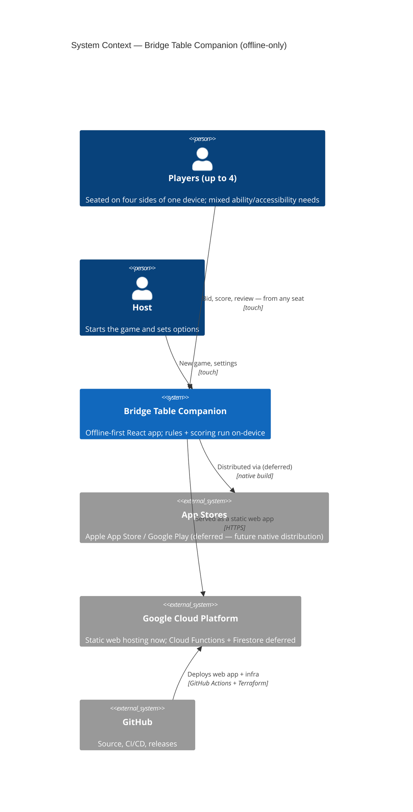

**Key point:** there is **no backend in the current build**. The app plays a complete game entirely on-device from local storage. GCP is used now only to **host the static web app**; Cloud Functions and Firestore are deferred to the future online/app-store version.

---

## 2. Container view (C4 L2)

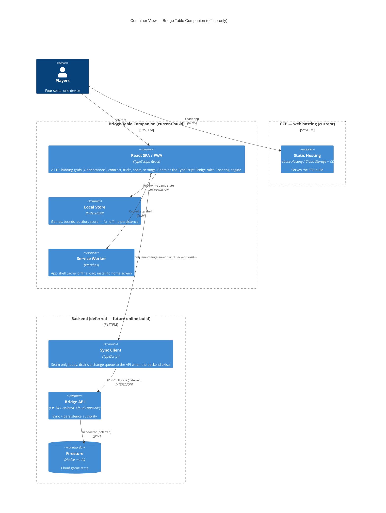

### 2.1 The rules engine lives once, in TypeScript

The Bridge engine (legal-bid validation, auction completion, declarer derivation, duplicate scoring) runs **only client-side in TypeScript**. Because the app is offline-only, there is no server acting as a competing authority, so there is a single implementation to build, test, and trust. If a backend is added later, the canonical specification (`API_SPEC.md` §6) and the engine's own test fixtures are what a server implementation would be held to — but that is **deferred**, not built now.

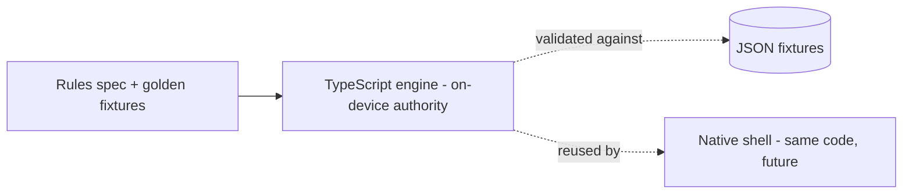

---

## 3. Component view (C4 L3) — React SPA

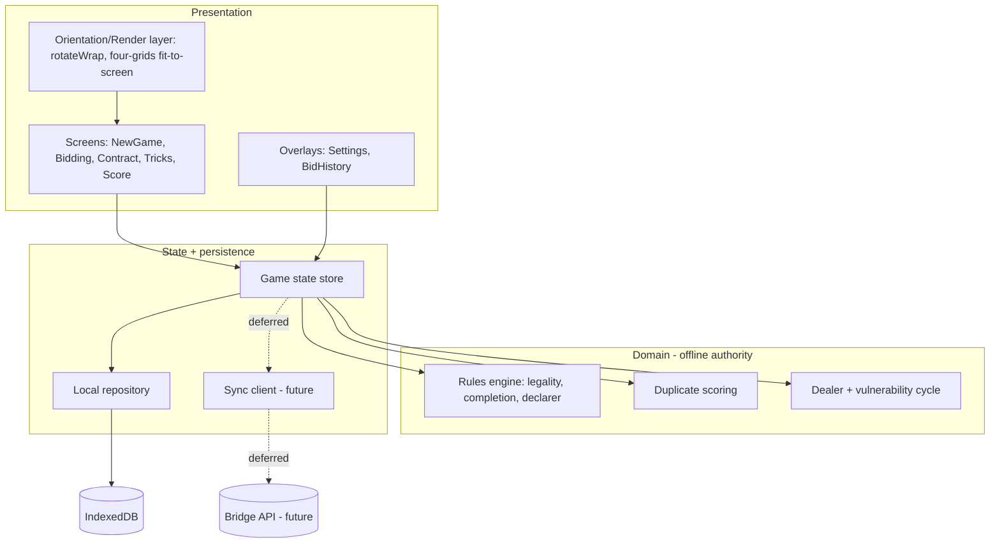

| Component | Responsibility |
|---|---|
| Screens / Overlays | The five screens + Settings/Bid-History, mapped 1:1 to the prototype. |
| Orientation layer | Four-sided rendering, the four-grids edge-pinned fit-to-screen scaling, animation/reduced-motion handling. |
| Rules engine / Scoring / Rotation | Pure, framework-free TypeScript modules — the on-device authority, fully unit-tested. |
| Game state store | Single source of in-memory truth; orchestrates engine + persistence. |
| Local repository | Maps state to/from IndexedDB; the offline persistence boundary. |
| Sync client *(deferred)* | A seam, not built now. When a backend exists it will queue mutations and reconcile; today the store persists locally and stops there. |

---

## 4. Backend (C# Cloud Functions) — **deferred**

> **Not part of the current offline-only build.** This section is retained as the intended design for the future online / app-store version so present-day choices stay compatible with it. No backend code, Firestore, or Cloud Functions are provisioned now.

When the backend is introduced (for cross-device persistence, shared sessions, or app-store sync), the intended shape is:


- **Runtime:** .NET (isolated worker) on GCP Cloud Functions (2nd gen).
- **Shape:** thin function entrypoints delegating to testable services — `RulesService`, `ScoringService`, `GameRepository`.
- **Authority:** would re-validate every mutation (never trusting a client-computed score), per `API_SPEC.md` §6.
- **Relationship to the TS engine:** at that point the team must decide whether to port the engine to C# (held to the same fixtures as the TS engine) or share one engine via WASM. That decision is deferred along with the backend — today there is a single TypeScript engine and nothing to keep in sync.

---

## 5. Deployment view

### 5.1 Environments

| Environment | Purpose | Frontend | Backend | Data |
|---|---|---|---|---|
| **Local** | Day-to-day dev | Container (Vite dev server) | — (none) | Seeded IndexedDB fixtures |
| **Test** | Shared QA + E2E | GCP static hosting | — (none) | Seeded IndexedDB fixtures |
| **Production** (later) | Public web, then app store | GCP static hosting / CDN | Deferred | Deferred |

Because the app is offline-only, **"data" is the browser's IndexedDB**, not a server database. The "seeded database" requirement is met by loading versioned fixtures into IndexedDB (see §9) for local dev and for the deployed test environment. Cloud Functions and Firestore rows in this table are **deferred** until the backend milestone.

### 5.2 Cloud deployment (Test / Prod) — web hosting only

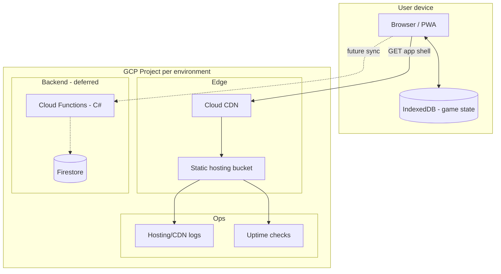

The only thing GCP serves today is the **static app shell** over CDN; the device then runs entirely against local IndexedDB. The dashed backend path is the deferred future.

### 5.3 Local development deployment (containers)

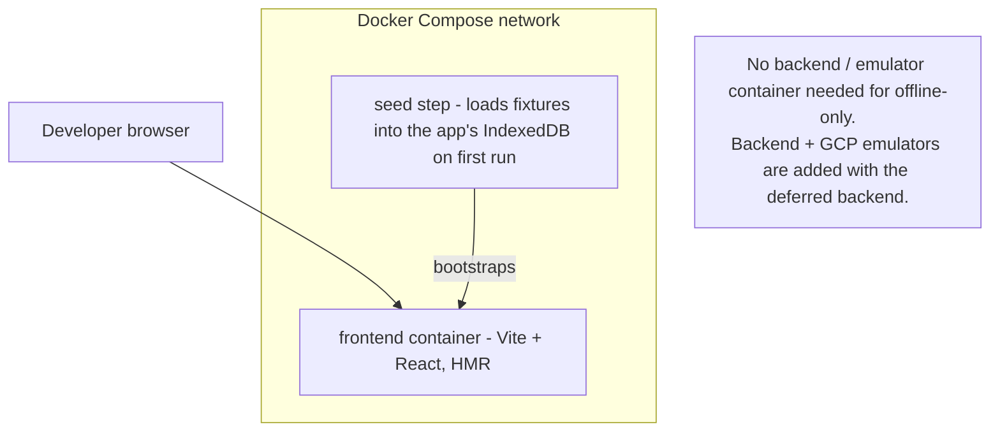

- `docker compose up` brings up the frontend container (Vite + React with hot reload); a seed step makes realistic games available immediately (see §9).
- No backend, no GCP emulator, and no GCP credentials are required to develop the offline app. The emulator-based setup returns when the backend does.

---

## 6. Monorepo structure

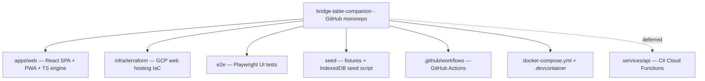

```
bridge-table-companion/
├─ apps/web/                # React + TypeScript SPA, PWA, IndexedDB
│  ├─ src/domain/           # rules, scoring, rotation (pure, unit-tested) — the engine
│  ├─ src/domain/fixtures/  # golden test cases for the engine
│  ├─ src/screens/          # NewGame, Bidding, Contract, Tricks, Score
│  ├─ src/render/           # orientation / four-grids fit-to-screen
│  └─ src/state/            # store, repository (IndexedDB), sync seam (deferred)
├─ infra/terraform/         # GCP IaC — static web hosting now; backend modules later
├─ seed/                    # versioned fixtures + IndexedDB seed script
├─ e2e/                     # Playwright specs for key user flows
├─ .github/workflows/       # CI/CD pipelines
├─ docker-compose.yml       # local: web container (+ seed)
├─ .devcontainer/           # reproducible dev container
└─ (deferred) services/api/ # C# .NET Cloud Functions — added with the backend milestone
```

**Why a monorepo even now:** one source of truth for the app, infra, seed data, and tests; atomic commits across UI and infra; and a ready home for `services/api` when the backend milestone arrives — without restructuring. The engine and its fixtures live together under `apps/web/src/domain`, since there is only the one TypeScript implementation to keep honest today.

---

## 7. CI/CD (GitHub Actions)

### 7.1 Pipeline overview

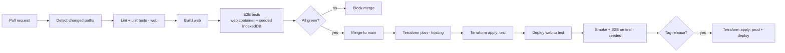

### 7.2 Workflows

| Workflow | Trigger | Does |
|---|---|---|
| `ci.yml` | PR + push | Path-filtered lint, unit tests (web), build, coverage gate. |
| `e2e.yml` | PR | Builds the web app, seeds IndexedDB fixtures, runs Playwright on key flows. |
| `infra.yml` | PR touching `infra/` + main | `terraform fmt/validate/plan` on PR; `apply` (hosting) to test on main. |
| `deploy-test.yml` | main (post-merge) | Terraform apply (hosting) → deploy web → smoke/E2E against seeded test build. |
| `release.yml` | git tag `v*` | Terraform apply prod → deploy web → (deferred) trigger native build. |

- **Coverage gate:** unit-test coverage threshold enforced for `apps/web`; PRs fail below threshold. (`services/api` coverage is added with the backend.)
- **Path filtering:** only changed areas rebuild, keeping the monorepo fast.
- **Auth to GCP:** GitHub Actions uses **Workload Identity Federation** (no long-lived service-account keys).

> When the backend lands, `ci.yml`/`e2e.yml` gain the C# build + emulator steps and `deploy-test.yml` regains the seed-DB and API-deploy stages. The pipeline is structured so those are additions, not rewrites.

---

## 8. Infrastructure as Code (Terraform on GCP)

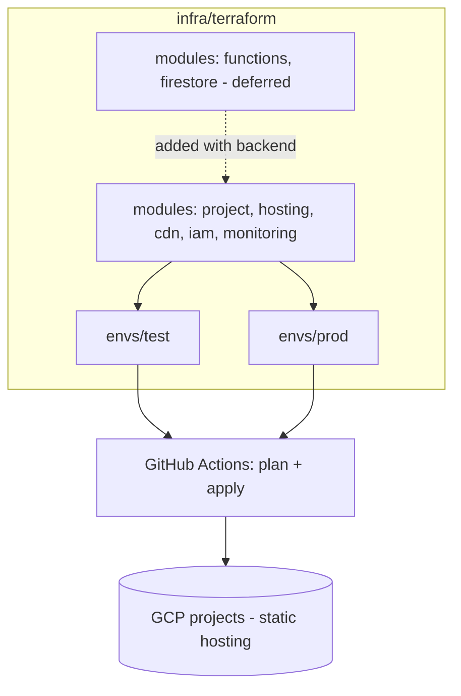

- **State:** remote Terraform state in a GCS bucket, locked, **one project per environment**.
- **Modules (now):** static hosting + CDN, IAM (least privilege), logging/monitoring, and the Workload Identity pool for Actions.
- **Modules (deferred):** Firestore (Native), Cloud Functions, Secret Manager — added with the backend milestone.
- **No manual console changes** — environments are reproducible and diffable.

---

## 9. Data seeding

Seeded data is required for local development and for the deployed test environment. Because the app is offline-only, the "database" is the browser's **IndexedDB**, so seeding loads fixtures into IndexedDB rather than a server DB.

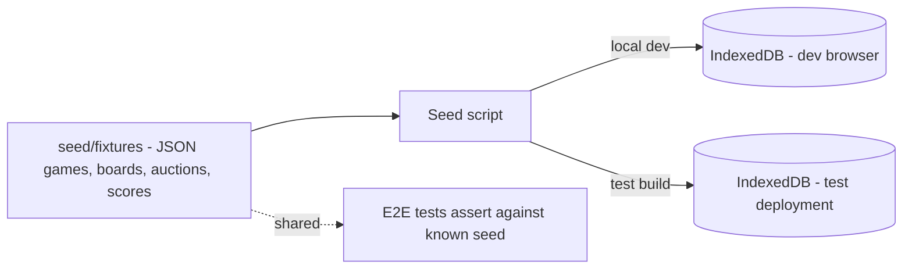

- **Fixtures** are versioned JSON: a passed-out board, a doubled making contract, a part-score, a slam, an undertrick set — covering scoring branches and the auction states the UI must render.
- The **same fixtures** seed the local dev browser, seed the test deployment, and back the deterministic assertions in E2E tests. (A query flag or dev-only seed button loads them into IndexedDB.)
- Seeding is **idempotent** (clear-then-load) so re-runs are safe.
- When the backend arrives, the identical fixtures will also seed Firestore (emulator locally, test project in the cloud) — the fixture format is chosen to serve both.

---

## 10. Local development environment

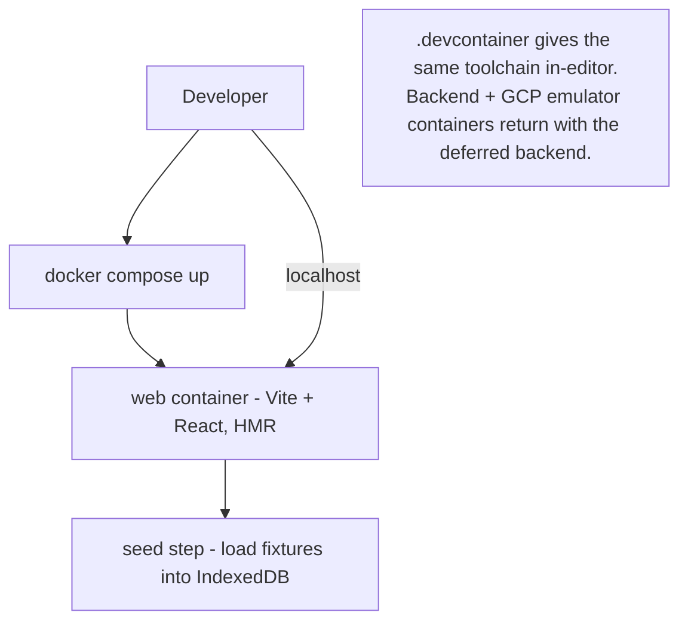

- **Container:** frontend (Vite + React with hot-module reload). A seed step makes realistic games available in IndexedDB on first run.
- **No backend or emulator** is needed for offline-only development, so there are no GCP credentials and no emulator container to manage today.
- **Devcontainer:** a `.devcontainer` definition pins the Node/Terraform toolchain so every contributor (and Codespaces) is identical. The .NET toolchain is added with the backend.

---

## 11. Testing strategy

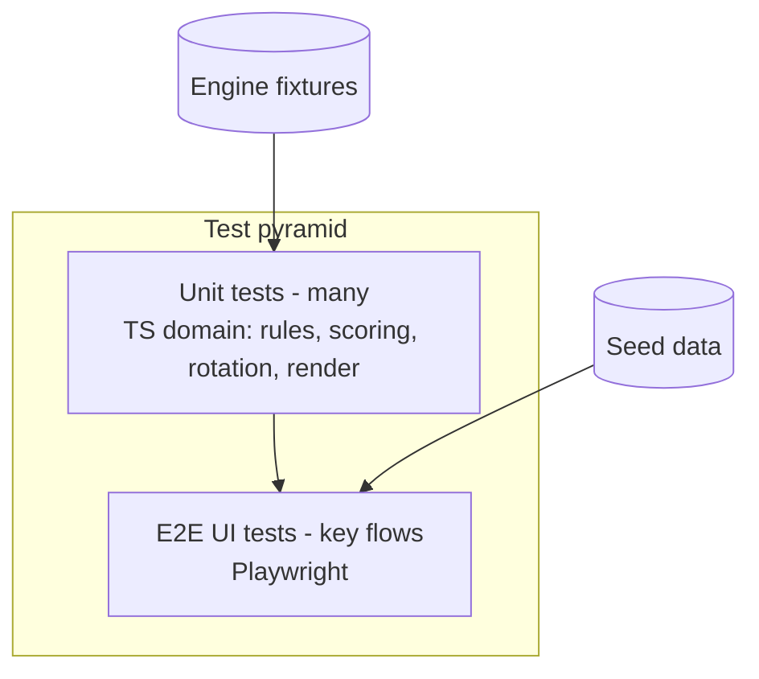

| Layer | Scope | Tooling | Gate |
|---|---|---|---|
| **Unit** | Rules, scoring, rotation, render helpers — all TypeScript. All code carries unit coverage. | Vitest | Coverage threshold enforced in CI. |
| **E2E UI** | Every key user flow end-to-end. | Playwright | Must pass to merge + on test deploy. |

> Integration tests against a Firestore emulator and C# service tests are **deferred** — they arrive with the backend. Today the engine is exercised directly by unit tests against its golden fixtures, which is the full authority for an offline app.

### 11.1 Key user flows covered by E2E

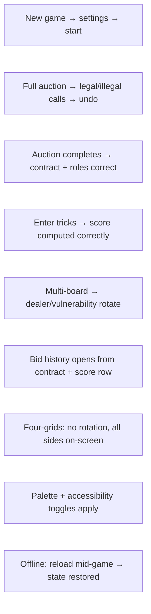

- **Engine fixtures:** the scoring and rules fixtures are run through the TypeScript engine in unit tests; every scoring branch (made, overtricks, doubled, vulnerable, slam, undertricks) has a golden case.
- **Offline test:** an E2E flow loads a game, goes offline, reloads, and asserts the game resumes from IndexedDB.

---

## 12. Offline behaviour

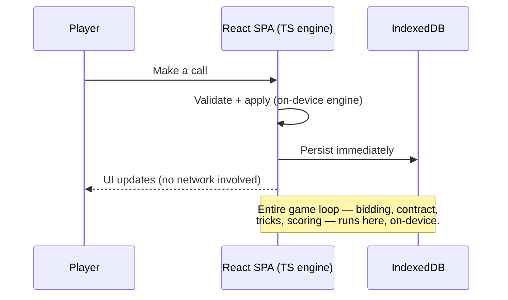

- The app **never touches the network** to play. Every action is validated by the TypeScript engine and persisted to IndexedDB.
- There is **no sync today**. The store writes locally and stops; a `sync client` exists only as a thin, dormant seam so the backend can be added later without reworking the store.
- Resuming a game after a reload or app restart reads straight from IndexedDB.

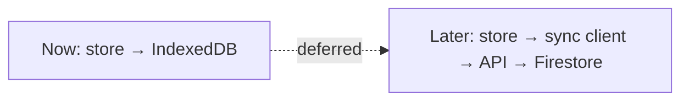

---

## 13. Path to the app store (future)

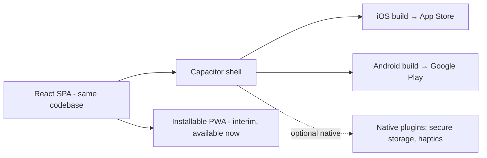

- The React app is wrapped with **Capacitor** to produce native iOS/Android builds from the same source — no rewrite.
- **Interim (now):** the PWA is installable to the home screen, giving an app-like experience for early testing while staying web-based and fully offline.
- The deferred C# backend becomes relevant for cross-device persistence and shared-session features; on-device offline play continues to work regardless.
- Native build + store submission would be added as a `release.yml` stage at that milestone.

---

## 14. Cross-cutting concerns

| Concern | Approach |
|---|---|
| **Accessibility** | First-class in the UI layer (large targets, high-contrast palette, shape+label suits, no-rotation mode, reduced-motion). Treated as acceptance criteria, not polish. |
| **Observability** | Hosting/CDN logs and uptime checks now. App-level error reporting (client) is in scope; backend observability is deferred with the backend. |
| **Secrets** | None required for the offline app. When the backend lands: Secret Manager, no secrets in the repo, Actions auth via Workload Identity Federation. |
| **Security** | Offline app holds data only on-device. Future backend would re-validate all mutations and use least-privilege IAM per environment. |
| **Config** | Same variable shapes across test/prod via Terraform; frontend reads environment at build time. |
| **Versioning** | Tagged releases drive prod deploys; engine fixtures are versioned with the app in the monorepo. |

---

## 15. Risks & decisions to revisit

| Item | Note |
|---|---|
| Single on-device engine | Now a strength: one TypeScript implementation, no duplication. If a backend authority is later required, decide then between a C# port (held to the same fixtures) or sharing the TS engine via WASM. |
| IndexedDB as sole store | Data lives only in the browser; clearing site data loses games. Acceptable for offline testing; cloud backup is part of the deferred backend. An export/import of games could be added cheaply if needed sooner. |
| Offline-first sync conflicts (deferred) | Single-device means no conflicts today; a conflict-resolution policy is needed before multi-device shared sessions ship. |
| App-store requirements | Native build introduces store review, signing, and platform-specific testing — scope these before committing to the native milestone. |
```

This version reflects the offline-only decision: a single TypeScript rules-and-scoring engine running on-device, IndexedDB persistence, GCP used now only to host the static web build, and the C# backend, Firestore, emulators, and cloud sync all clearly marked **deferred** — documented so today's structure stays compatible with them without being burdened by them.
