# Bridge Table Companion — Architecture Document

## 0. About this document

This describes the **as-built** architecture of the Bridge Table Companion: an
offline-first, table-centre Bridge bidding and scoring aid. The application has
been implemented as a **React + TypeScript single-page app (PWA)** whose rules and
scoring run entirely on-device, persisting to the browser's IndexedDB. There is
**no backend**: a C# / Cloud Functions / Firestore service remains a documented
**deferred** milestone (see §4) so today's choices stay compatible with it, but it
is not built.

It uses the **C4 model** (Context → Container → Component) plus deployment/cloud,
pipeline, and runtime diagrams. All diagrams are Mermaid and render on GitHub.

> **Status legend.** **(built)** = implemented and in the repository today.
> **(deferred)** = intended future work, documented but not built.

### Guiding decisions (the short version)

| Decision | Choice | Why |
|---|---|---|
| Offline behaviour | **Offline-first (built).** A full game plays with no network. | The product is one device on a table; connectivity must never be required mid-game. |
| Rules + scoring | **TypeScript only (built)**, pure modules in the client. | Offline-only — no server authority, so the engine lives once, in `src/domain`, fully unit-tested against golden fixtures. |
| Frontend | **React 18 + TypeScript SPA, PWA** (Vite 5, `vite-plugin-pwa`/Workbox). | Rich four-orientation UI; installable to the home screen; reused for a native shell later. |
| State | **Pure reducer + React context** (`src/state`). | A single, testable source of truth orchestrating the engine and persistence. |
| Persistence (local) | **IndexedDB** via `idb`, single `current` game document. | True offline storage; resume after reload. |
| Persistence (cloud) | **Deferred** (Firestore, when a backend arrives). | Not needed for offline play. |
| Backend | **Deferred.** | Offline play needs none; keeping it out removes a whole class of complexity. |
| Repo | **GitHub monorepo** (npm workspaces). | One source of truth for app, infra, seed, and tests. |
| CI/CD | **GitHub Actions** (6 workflows). | Lint, typecheck, unit+coverage, build, Playwright E2E, axe a11y, deploy. |
| Hosting | **GitHub Pages (built)** for the live installable PWA; **GCP static hosting via Terraform (built, gated)** for the test/prod web target. | Pages gives trusted HTTPS for iPad/PWA testing now; GCP is the reproducible production host, activated when project vars are set. |
| Local dev | **Vite dev server (port 5273)**, Docker Compose + devcontainer, seeded fixtures. | Consistent toolchain; LAN-reachable for tablet testing. |
| Native | **Capacitor** wrapper (future) + installable PWA (now). | Reuse the same source as the iOS/Android shell. |

---

## 1. System context (C4 L1)

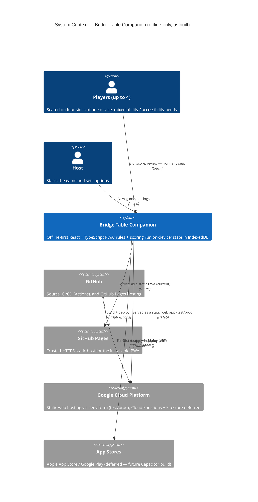

**Key point:** there is **no backend**. The app plays a complete game entirely
on-device from local storage. Cloud providers serve only the **static app shell**;
the device then runs against local IndexedDB. Cloud Functions and Firestore are
deferred (§4).

---

## 2. Container view (C4 L2)

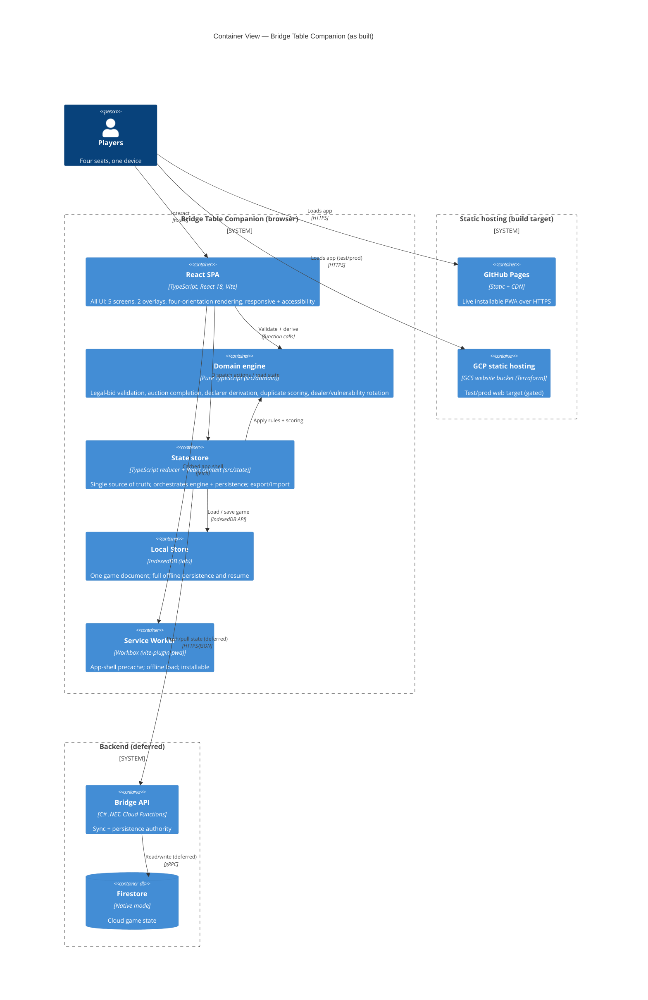

### 2.1 The engine lives once, in TypeScript

The Bridge engine runs **only client-side**, as pure framework-free modules in
`apps/web/src/domain`. Because the app is offline-only there is no competing
server authority — a single implementation to build, test, and trust. It is held
to **golden JSON-style fixtures** in unit tests (≈96%+ coverage on the domain).
If a backend is added later, those fixtures and `API_SPEC.md` §6 are the contract
a server would be held to.

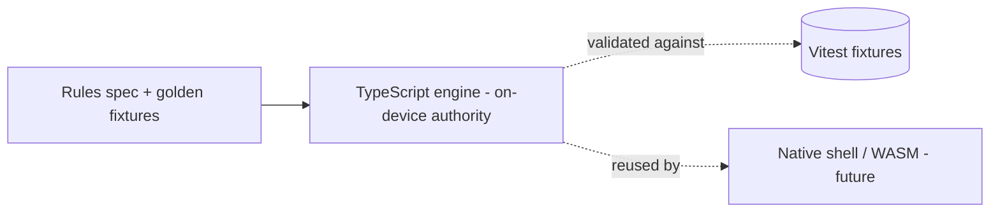

---

## 3. Component view (C4 L3) — the React SPA

The app is organised into pure domain, state, render helpers, screens, and
overlays. Arrows are runtime dependencies.

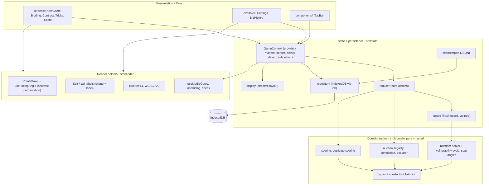

| Component | Responsibility |
|---|---|
| `screens/` | The five screens mapped 1:1 to the product flow (NewGame → Bidding → Contract → Tricks → Score). |
| `overlays/` | Settings (palette, layout, animations, sound, **extra-large accessibility**, export/import) and BidHistory (dual-flip auction), both accessible dialogs. |
| `render/` | Four-sided rendering (`RotateWrap` + `useFacingAngle`), shape+label suits, palettes, `useMediaQuery` (viewport device detection), `useDialog` (focus trap/Escape/restore), optional spoken bids. |
| `state/` | `GameContext` provider (hydrate from IndexedDB, persist on change, device/display state, palette/speech side effects, action wrappers); `reducer` (pure); `repository` (idb); `exportImport`; `display` (effective layout). |
| `domain/` | Pure, framework-free engine: `auction`, `scoring`, `rotation`, `types`, `constants`, `fixtures`. The on-device authority, unit-tested. |

---

## 4. Backend (C# Cloud Functions) — **deferred**

> **Not built.** Retained as the intended design for a future online / app-store
> version so present-day choices stay compatible. No backend code, Firestore, or
> Cloud Functions are provisioned. `DATA_MODEL.md` and `API_SPEC.md` describe this
> milestone; today the equivalent shapes live locally (IndexedDB) — see
> `DATA_MODEL.md` §0.

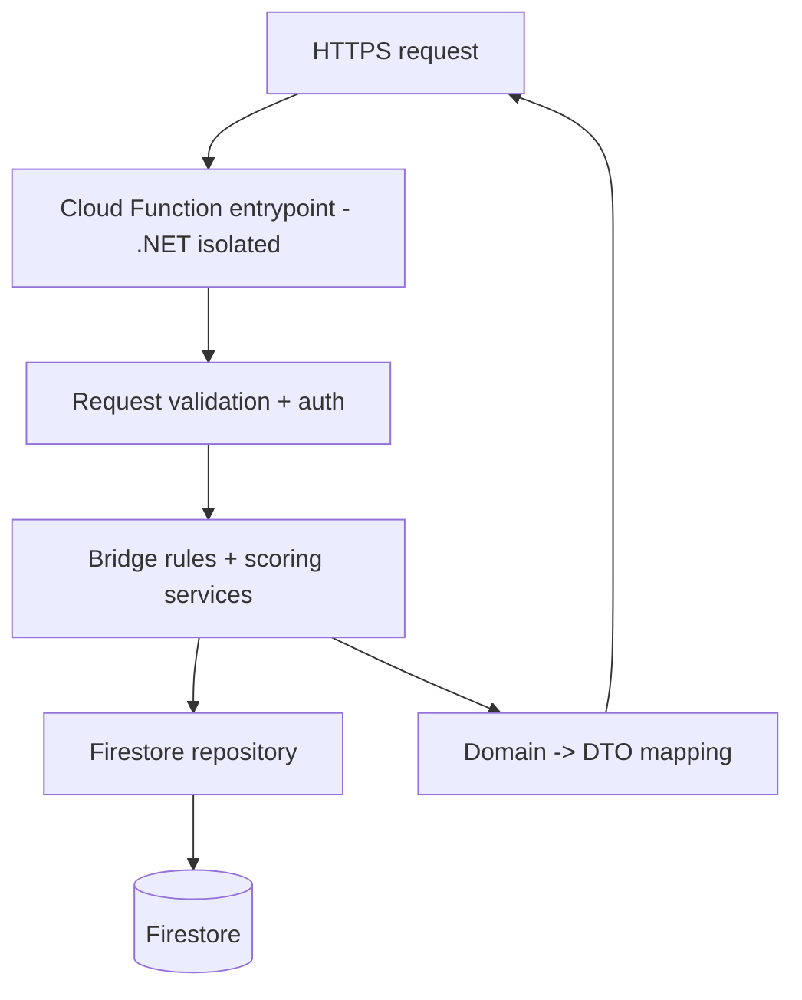

When introduced, the team chooses between porting the engine to C# (held to the
same fixtures) or sharing the TypeScript engine via WASM. That decision is
deferred along with the backend.

---

## 5. Deployment & cloud architecture

### 5.1 Environments

| Environment | Purpose | Frontend host | Backend | Data |
|---|---|---|---|---|
| **Local** | Day-to-day dev | Vite dev server (`:5273`) | — | Seeded IndexedDB fixtures |
| **Pages** (live now) | Shareable installable PWA / device testing | **GitHub Pages** (HTTPS) | — | Browser IndexedDB |
| **Test** | Shared QA + E2E | **GCP static hosting** (Terraform, gated) | — | Browser IndexedDB |
| **Production** | Public web, then app store | **GCP static hosting / CDN** (Terraform, gated) | Deferred | Browser IndexedDB |

"Data" is always the **browser's IndexedDB**, not a server database. GitHub Pages
is active today (used for iPad/PWA testing at `/<repo>/` base); GCP hosting is
fully scaffolded in Terraform and activates once the `GCP_PROJECT_ID` repo
variable is set.

### 5.2 Cloud architecture (build + serve)

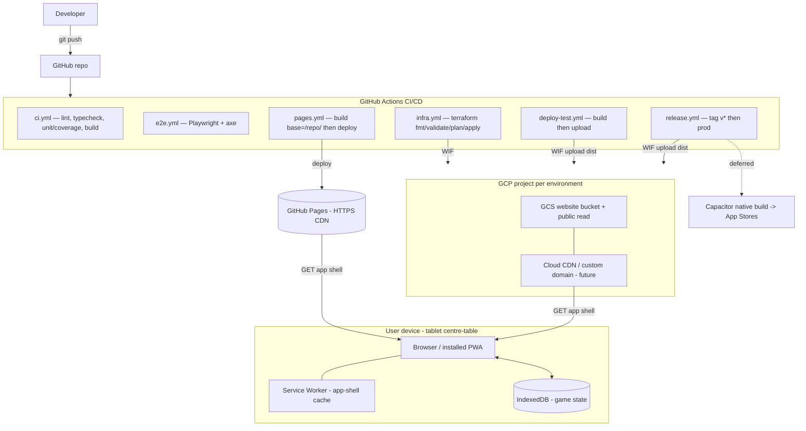

- **Auth to GCP:** GitHub Actions uses **Workload Identity Federation** (no
  long-lived service-account keys). Deploy/infra jobs are guarded by repo
  variables (`GCP_PROJECT_ID`, `GCP_WIF_PROVIDER`, `GCP_DEPLOY_SA`, bucket names)
  and no-op until those are set.
- **The only cloud surface is static hosting.** Once loaded, the device runs
  entirely against the service worker cache and IndexedDB.

### 5.3 Local development

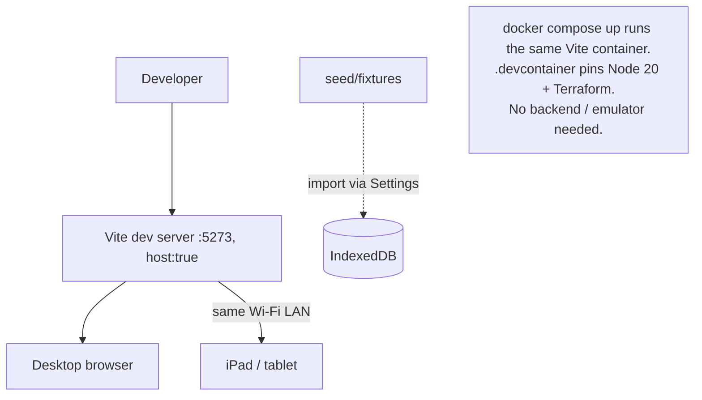

`host: true` binds the dev server to the LAN so a tablet on the same Wi-Fi can
load `http://<mac-ip>:5273`. The PWA service worker is only active in the
production build / on HTTPS hosts (Pages/GCP), so true offline + install is tested
there.

---

## 6. Monorepo structure (as built)

```
bridge-table-companion/
├─ apps/web/                      # React + TypeScript SPA, PWA, IndexedDB
│  ├─ index.html                  # PWA + iOS standalone meta + apple-touch-icon
│  ├─ vite.config.ts              # Vite + PWA + Vitest config; base, port 5273
│  ├─ public/                     # favicon.svg, icon-192/512.png, apple-touch-icon.png
│  └─ src/
│     ├─ domain/                  # rules, scoring, rotation (pure) + fixtures + *.test.ts
│     ├─ state/                   # reducer, GameContext, repository (idb), exportImport, display, board
│     ├─ render/                  # RotateWrap, useFacingAngle, useMediaQuery, useDialog, palettes, Suit, speak
│     ├─ screens/                 # NewGame, Bidding, Contract, Tricks, Score, result
│     ├─ overlays/                # Settings, BidHistory
│     ├─ components/              # TopBar
│     ├─ App.tsx / main.tsx       # composition + entry
│     └─ index.css                # all styles (palettes, responsive, accessibility)
├─ e2e/                           # Playwright: game-flow, offline-resume, responsive, a11y (axe)
├─ seed/                          # versioned game fixtures (importable)
├─ infra/terraform/               # GCP static-hosting IaC (modules/hosting; envs test/prod)
├─ .github/workflows/             # ci, e2e, pages, infra, deploy-test, release
├─ docker-compose.yml             # local frontend container
├─ .devcontainer/                 # reproducible Node 20 + Terraform toolchain
└─ (deferred) services/api/       # C# .NET Cloud Functions — added with the backend
```

`apps/*` and `e2e` are **npm workspaces**; root scripts (`dev`, `build`, `test`,
`test:coverage`, `lint`, `typecheck`, `e2e`) fan out to them.

---

## 7. CI/CD (GitHub Actions)

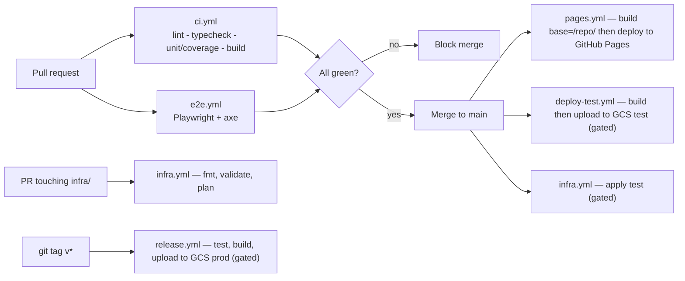

| Workflow | Trigger | Does |
|---|---|---|
| `ci.yml` | PR + push main | Lint, typecheck, unit tests with **coverage gate**, build; uploads coverage. |
| `e2e.yml` | PR | Build web, install Playwright browsers, run E2E (incl. axe a11y). |
| `pages.yml` | push main | Build with `VITE_BASE=/Bidding-Box/`, deploy to **GitHub Pages**. |
| `infra.yml` | PR/`push` touching `infra/` | `terraform fmt`/`validate`/`plan` (PR), `apply` test (main) — gated + WIF. |
| `deploy-test.yml` | push main | Build, upload `dist` to GCS test bucket — gated + WIF. |
| `release.yml` | tag `v*` | Re-run tests, build, upload to GCS prod bucket — gated + WIF. |

- **Coverage gate:** enforced for `apps/web`. Scoped to the pure layer
  (`src/domain`, `src/state`): domain ≈96% lines / 100% functions / 88% branches;
  React glue and the IndexedDB repository are exercised by E2E instead.
- **Auth to GCP:** Workload Identity Federation; GCP jobs no-op without repo vars.

---

## 8. Infrastructure as Code (Terraform on GCP)

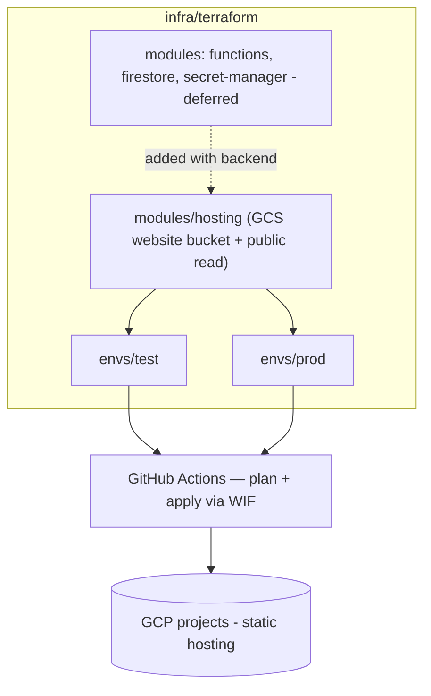

- **State:** remote Terraform state in a GCS bucket (`backend "gcs"`, one prefix
  per environment); one project per environment.
- **Module (now):** `hosting` — a website-enabled GCS bucket with public object
  read and SPA fallback (`index.html` as 404). A CDN / custom domain fronts it in
  production.
- **Modules (deferred):** Firestore, Cloud Functions, Secret Manager.
- **No manual console changes** — environments are reproducible and diffable.

---

## 9. Data seeding

Because the app is offline-only, the "database" is the browser's IndexedDB.
`seed/fixtures/*.json` are games in the app's **export format**, loadable today via
**Settings → Game Data → Import Game**. A dev query-flag seed and E2E seeding are
planned seams. Fixtures cover scoring branches and auction states; `sample-game`
includes a made part-score and a passed-out board. See `seed/README.md`.

---

## 10. Testing strategy

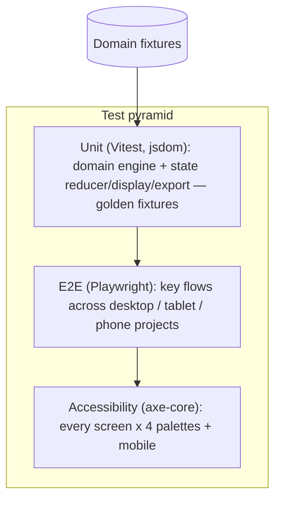

| Layer | Scope | Tooling | Gate |
|---|---|---|---|
| **Unit** | Rules, scoring, rotation, reducer, display, export/import. | Vitest + v8 coverage | Coverage threshold in CI. |
| **E2E** | New game → auction → contract → tricks → score; undo; offline resume; responsive reflow; settings. | Playwright (desktop Chromium, tablet WebKit/iPad, phone Chromium/Pixel 5) | Must pass to merge. |
| **Accessibility** | WCAG 2.1/2.2 A/AA incl. `target-size`. | `@axe-core/playwright` | Zero violations across all palettes (desktop) + compact (phone). |

E2E runs against `vite preview` (`:4173`) of the production build. Key flows:
new-game/settings, full auction + legal/illegal + undo, contract + roles, tricks +
score, multi-board rotation, bid history, four-grids no-rotation, palette +
accessibility toggles, offline reload, responsive resize (desktop↔mobile),
double-sided strips, and dialog keyboard behaviour.

---

## 11. Offline behaviour

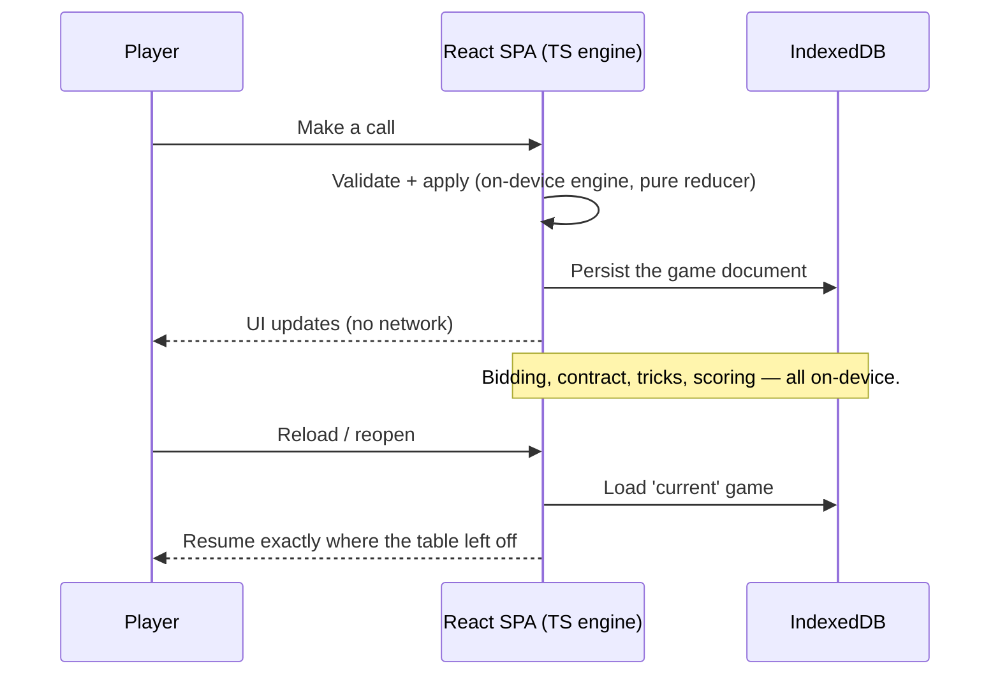

- The app **never touches the network** to play. Every action is validated by the
  TypeScript engine and persisted to IndexedDB under a single `current` key.
- The **service worker** (Workbox, `autoUpdate`) precaches the app shell so the
  app loads and installs offline on HTTPS hosts.
- A lightweight **JSON export/import** mitigates IndexedDB being device-local.

---

## 12. Responsive & rendering architecture

The defining technical feature is rendering content to face each of four seats,
on any screen size.

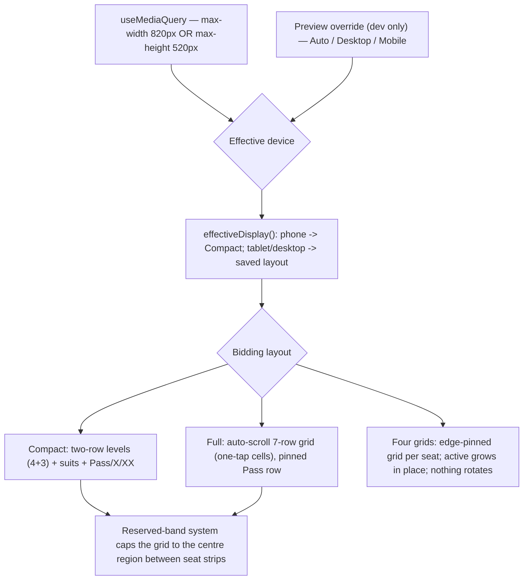

- **Viewport-driven:** the app reacts to real window size; the on-screen
  Auto/Desktop/Mobile toggle is a **dev-only** preview override.
- **Reserved-band system (no overlap):** one band per edge holds that seat's
  history strip; the grid is a fixed-shape block capped (via container-query
  units) to the centre region between opposing bands, on **both** axes so a 90°
  rotation never collides. Four-grids pins history at the edge and the grid
  inboard, so the active grid grows toward the centre and never displaces the
  fixed history. This is pure CSS — no JS measuring.
- **Fluid sizing:** `clamp()` + container-query units so every grid/card scales
  with the band as the screen shrinks; index font never below the 12px floor.
- **Rotation:** the single-grid block rotates to face the bidder via
  `useFacingAngle` — a continuous angle that always turns the shorter way (≤180°)
  following clockwise play; South stays upright. Four-grids never rotates.
- **Double-sided cards:** each bid card shows its index in opposite corners (like
  a playing card) plus a central suit pip, so its bid reads from both the seat and
  the opposite side without a second stacked card.

---

## 13. Accessibility architecture

Accessibility is treated as acceptance criteria, held to **WCAG 2.1/2.2 AA** and
gated by the axe suite (§10).

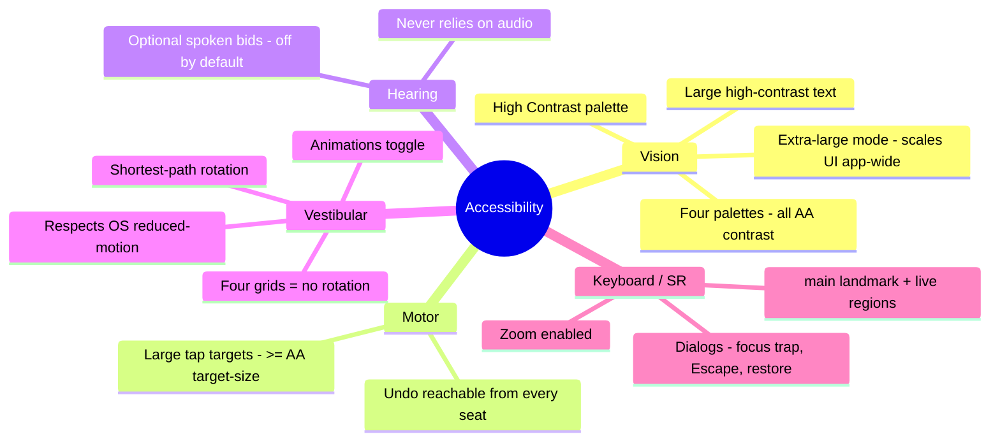

- **Extra-large mode** (`settings.accessibility` → `data-accessible`): scales
  text, controls, and the bidding grid up across all screens; Compact gives the
  largest targets.
- **Dialogs** (`useDialog`): Settings and Bid History move focus in, trap Tab,
  close on Escape, restore focus to the trigger.
- **Live regions** announce whose turn it is and the derived contract; `<main>`
  landmark; all icon buttons labelled; suits carry shape **and** label.
- Pinch-zoom is allowed; OS reduced-motion is honoured automatically.

---

## 14. PWA / path to the app store

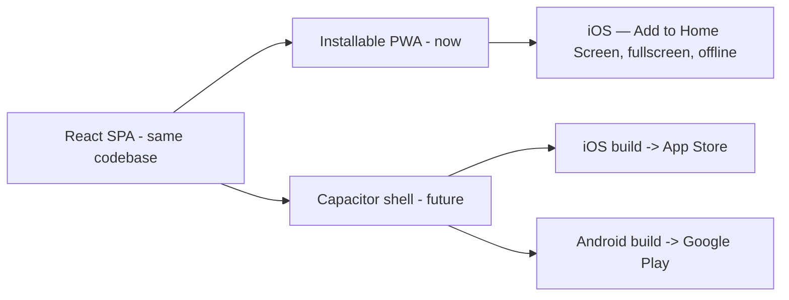

- **Now:** `vite-plugin-pwa` (Workbox, `autoUpdate`) + a fullscreen manifest, PNG
  icons, and iOS standalone meta (`apple-touch-icon`, `apple-mobile-web-app-*`).
  Installs to the iPad home screen and runs offline over HTTPS (GitHub Pages).
- **Future:** a Capacitor wrapper produces native iOS/Android builds from the same
  source; the deferred backend becomes relevant for cross-device sync.

---

## 15. Cross-cutting concerns

| Concern | Approach |
|---|---|
| **Accessibility** | First-class; AA-gated by axe; extra-large mode, palettes, focus management, live regions (§13). |
| **Observability** | Hosting/CDN logs (GCP) and Pages status now. Client error reporting is in scope; backend observability deferred. |
| **Secrets** | None for the offline app. GCP auth via Workload Identity Federation (no keys in repo); Secret Manager arrives with the backend. |
| **Security** | Data lives only on-device. Static hosting only. A future backend would re-validate all mutations with least-privilege IAM. |
| **Config** | `VITE_BASE` selects the host base path (`/` locally, `/Bidding-Box/` on Pages); Terraform vars per environment. |
| **Versioning** | Tagged releases drive prod deploys; engine fixtures and `state.schemaVersion` (with a `migrate` seam) are versioned with the app. |

---

## 16. Risks & decisions to revisit

| Item | Note |
|---|---|
| Single on-device engine | A strength today: one TypeScript implementation, no duplication. If a backend authority is later required, decide between a C# port (same fixtures) or sharing the TS engine via WASM. |
| IndexedDB as sole store | Data lives only in the browser; clearing site data loses games. Mitigated by JSON export/import; cloud backup is part of the deferred backend. |
| Two hosting targets | GitHub Pages (live) and GCP (gated) both exist. Decide the canonical production host before launch; the build supports either via `VITE_BASE`. |
| Offline-first sync conflicts (deferred) | Single-device means no conflicts today; a conflict-resolution policy is needed before multi-device shared sessions ship. |
| App-store requirements | A native (Capacitor) build introduces store review, signing, and platform testing — scope before committing. |
```

This document reflects the **as-built** offline-only application: a single
TypeScript rules-and-scoring engine running on-device, a pure reducer + IndexedDB
state layer, a responsive and accessibility-first React UI, GitHub Pages + GCP
static hosting driven by GitHub Actions, and the C# backend, Firestore, and cloud
sync all clearly marked **deferred**.
