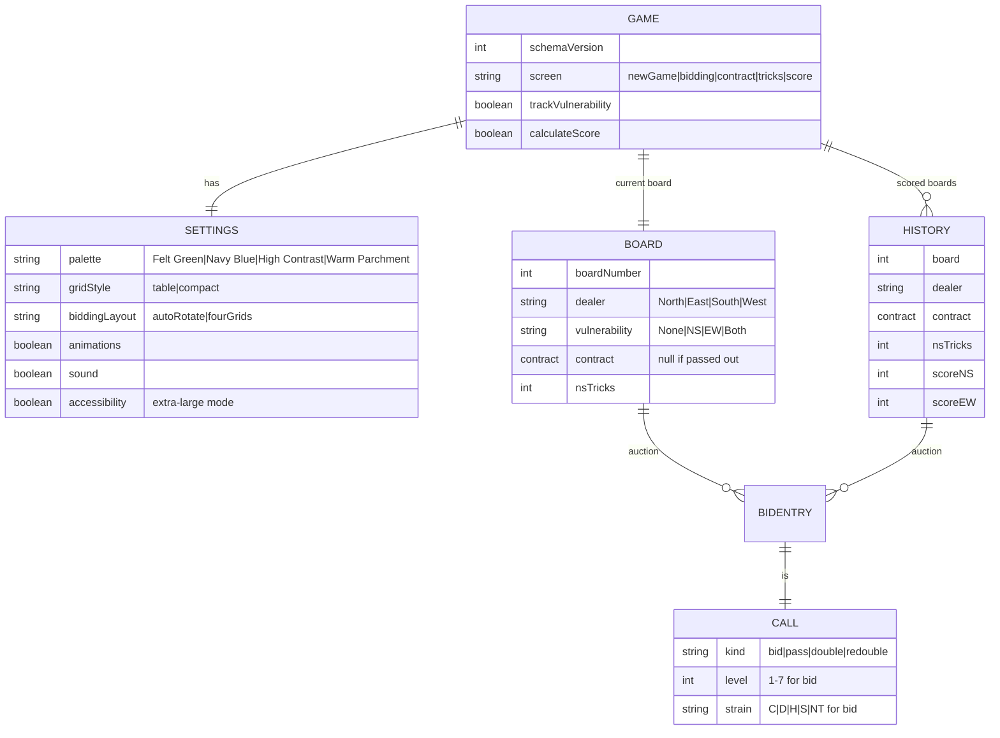
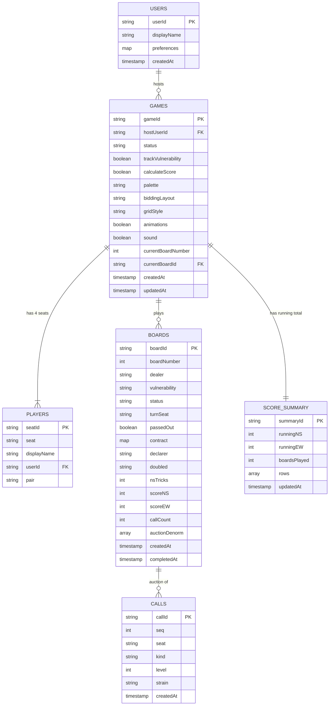
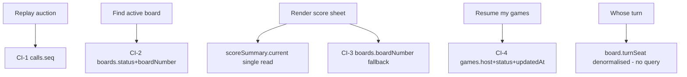
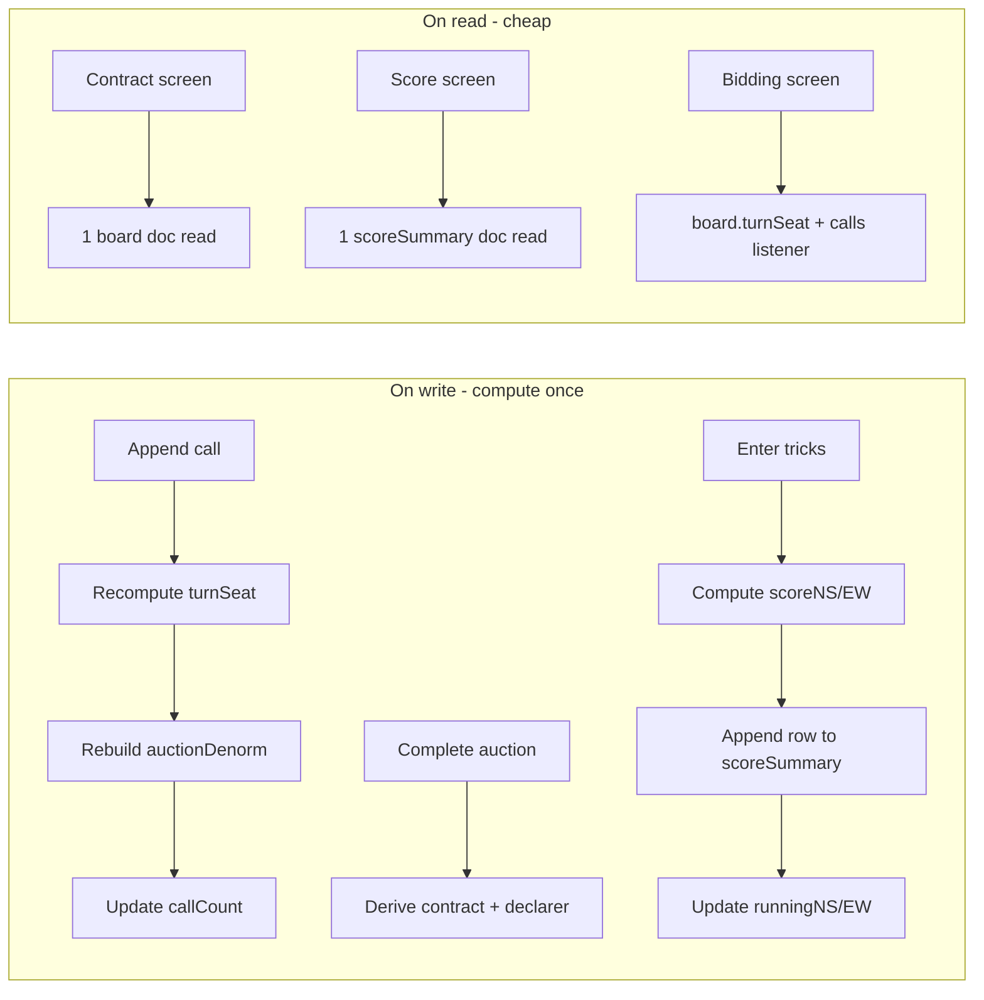

# Bridge Table Companion — Data Model

This document covers two layers:

- **§0 — the as-built local model (IndexedDB).** What the shipped offline app
  actually stores today.
- **§1 onward — the deferred Firestore model.** The schema for a future
  online-capable backend, kept aligned so the two stay compatible.

> **Scope note.** The app is **offline-only and built**. Persistence is the
> browser's **IndexedDB**; there is no backend. The Firestore design from §1
> onward is **deferred** (session persistence across devices, multi-device sync)
> and is documented so today's shapes don't paint us into a corner.

---

## 0. As-built local model (IndexedDB)

The shipped app persists the **entire game** as a single document under one key,
which is all an offline single-device game needs. See
`apps/web/src/state/types.ts` and `apps/web/src/state/repository.ts`.

- **Database:** `bridge-table-companion` · **object store:** `game` · **key:**
  `current` (one in-progress/last game). A `migrate()` seam upgrades older
  documents by `schemaVersion`.
- The same shape is the **export/import** format (wrapped with an `app` tag and
  `exportedAt`) and the **seed fixture** format (`seed/fixtures/*.json`).



| Type | Fields | Notes |
|---|---|---|
| `GameState` | `schemaVersion`, `screen`, `trackVulnerability`, `calculateScore`, `settings`, `board`, `history[]` | The whole persisted document. |
| `GameSettings` | `palette`, `gridStyle`, `biddingLayout`, `animations`, `sound`, `accessibility` | Carries the extra-large accessibility toggle. |
| `BoardState` | `boardNumber`, `dealer`, `vulnerability`, `bids[]`, `contract`, `nsTricks` | The live board. `vulnerability` is `None` when tracking is off. |
| `HistoryEntry` | `board`, `dealer`, `contract`, `nsTricks`, `scoreNS`, `scoreEW`, `bids[]` | One per completed board; recorded even when scoring is off or passed out (so past auctions stay reviewable). |
| `BidEntry` | `seat`, `call` | The canonical auction; `call` is a discriminated union (`bid`/`pass`/`double`/`redouble`). |
| `Contract` | `level`, `strain`, `declarer`, `doubled` | Derived on auction completion; `null` for a passed-out board. |

**Relationship to the Firestore model below.** The local `board.bids[]` array is
the equivalent of the `calls` subcollection; `history[]` is the equivalent of the
`scoreSummary.rows` / per-board scores. Because a single offline device reads and
writes one game, the local model favours one self-contained document over the
normalised, denormalised-for-fan-out Firestore design.

---

# Deferred: Firestore Data Model

The remainder of this document specifies the schema for a future **Cloud
Firestore** (Firebase) backend — **deferred, not built**. Firestore is a document
database, so the "tables" below are **collections**, rows are **documents**, and
"columns" are **document fields**. The design is optimised for the app's real
access patterns: a short-lived game session, an append-heavy auction, and a score
sheet read simultaneously from all four sides of one device.

---

## 1. Design principles

- **Session-scoped.** A game is the top-level aggregate. Almost all reads happen within one game, so the game is the natural document root and most data nests beneath it.
- **Append-only auction.** Calls are never edited, only appended or popped (undo). This favours a subcollection of immutable call documents over an array that must be rewritten on every bid.
- **Read from four sides at once.** The Contract and Score screens are read concurrently by up to four clients. Derived/denormalised summaries are stored so a single document read serves a whole screen without recomputation.
- **Compute-on-write, read-cheap.** Scoring and contract derivation happen once, on write, and are stored. Clients never recompute them on read.
- **Small documents, shallow reads.** Firestore bills per document read and caps documents at ~1 MiB. Keeping boards and calls as separate documents keeps reads small and real-time listeners cheap.

---

## 2. Collection overview

```
users/{userId}
games/{gameId}
games/{gameId}/players/{seatId}
games/{gameId}/boards/{boardId}
games/{gameId}/boards/{boardId}/calls/{callId}
games/{gameId}/scoreSummary/{summaryId}   (single doc: "current")
```

| Collection | Purpose | Lifecycle |
|---|---|---|
| `users` | Optional account record for a host. | Long-lived. |
| `games` | One game session; the top-level aggregate. | Created at New Game, ends at New Game/abandon. |
| `players` (sub) | The four seats and who occupies them, plus per-seat settings. | Lives with the game. |
| `boards` (sub) | One document per board played; holds dealer, vulnerability, contract, tricks, score. | Append per board. |
| `calls` (sub) | One immutable document per call in a board's auction. | Append/pop during bidding. |
| `scoreSummary` (sub) | A single denormalised running-total document for the score sheet. | Rewritten on each board completion. |

---

## 3. Entity Relationship Diagram



---

## 4. Collection specifications

### 4.1 `users/{userId}`

Optional — only present when a host signs in. Anonymous/offline play needs no user document.

| Field | Type | Notes |
|---|---|---|
| `userId` | string (doc id) | Firebase Auth UID. |
| `displayName` | string | Host's display name. |
| `preferences` | map | Default palette, layout, toggles carried into new games. |
| `createdAt` | timestamp | Server timestamp. |

### 4.2 `games/{gameId}`

The session aggregate and the source of truth for settings and "where are we now".

| Field | Type | Notes |
|---|---|---|
| `gameId` | string (doc id) | Auto-id. |
| `hostUserId` | string \| null | FK to `users`; null for anonymous play. |
| `status` | string enum | `active` \| `completed` \| `abandoned`. |
| `trackVulnerability` | boolean | New Game toggle. |
| `calculateScore` | boolean | New Game toggle. Drives whether Tricks/Score screens appear. |
| `palette` | string enum | `feltGreen` \| `navyBlue` \| `highContrast` \| `warmParchment`. |
| `biddingLayout` | string enum | `autoRotate` \| `fourGrids`. |
| `gridStyle` | string enum | `table` (full) \| `compact`. Used when `biddingLayout = autoRotate`. |
| `animations` | boolean | Motion toggle. |
| `sound` | boolean | Spoken-bid toggle. |
| `currentBoardNumber` | int | Convenience pointer; mirrors the active board. |
| `currentBoardId` | string FK | **Denormalised** pointer to the active board doc. |
| `createdAt` / `updatedAt` | timestamp | Server timestamps. |

### 4.3 `games/{gameId}/players/{seatId}`

Exactly four documents, keyed by seat for direct lookup.

| Field | Type | Notes |
|---|---|---|
| `seatId` | string (doc id) | `north` \| `east` \| `south` \| `west`. |
| `seat` | string enum | Same as id; explicit for queries. |
| `displayName` | string | Optional player name shown in bid strips and role badges. |
| `userId` | string \| null | FK if that seat is a signed-in user. |
| `pair` | string enum | **Denormalised** `NS` \| `EW`; avoids deriving partnership on every render. |

### 4.4 `games/{gameId}/boards/{boardId}`

One per board. Holds everything the Contract and Score screens need in a single read.

| Field | Type | Notes |
|---|---|---|
| `boardId` | string (doc id) | Auto-id (or `board-{n}`). |
| `boardNumber` | int | 1-based. Drives dealer/vulnerability cycle. |
| `dealer` | string enum | `north`\|`east`\|`south`\|`west`. Derived from `boardNumber`. |
| `vulnerability` | string enum | `none`\|`NS`\|`EW`\|`both`. Derived from `boardNumber` (16-board cycle). |
| `status` | string enum | `bidding` \| `contract` \| `tricks` \| `scored`. |
| `turnSeat` | string enum | **Denormalised** current bidder; avoids replaying the auction to find whose turn it is. |
| `passedOut` | boolean | True when four passes opened the board. |
| `contract` | map \| null | `{ level:int, strain:string }`; null if passed out. |
| `declarer` | string \| null | **Denormalised** derived declarer seat. |
| `doubled` | string enum | `none` \| `doubled` \| `redoubled`. |
| `nsTricks` | int | Tricks won by N/S (0–13). |
| `scoreNS` / `scoreEW` | int | **Computed-on-write** duplicate score for this board. |
| `callCount` | int | **Denormalised** length of the auction; cheap progress/legality checks. |
| `auctionDenorm` | array<map> | **Denormalised** compact copy of the full auction (see §6.2) for one-read history. |
| `createdAt` / `completedAt` | timestamp | Server timestamps. |

### 4.5 `games/{gameId}/boards/{boardId}/calls/{callId}`

Immutable, append-only. The canonical auction.

| Field | Type | Notes |
|---|---|---|
| `callId` | string (doc id) | Auto-id. |
| `seq` | int | 0-based position in the auction. Primary sort key. |
| `seat` | string enum | Seat that made the call. |
| `kind` | string enum | `bid` \| `pass` \| `double` \| `redouble`. |
| `level` | int \| null | 1–7 for `bid`; null otherwise. |
| `strain` | string \| null | `C`\|`D`\|`H`\|`S`\|`NT` for `bid`; null otherwise. |
| `createdAt` | timestamp | Server timestamp; tiebreaker for `seq`. |

> **Undo** pops the highest-`seq` call (delete the last document) and decrements `board.callCount`, then recomputes `turnSeat` and `auctionDenorm`.

### 4.6 `games/{gameId}/scoreSummary/current`

A single document holding the running total and a render-ready row list for the Score screen.

| Field | Type | Notes |
|---|---|---|
| `summaryId` | string (doc id) | Always `current`. |
| `runningNS` / `runningEW` | int | **Denormalised** session totals; the Score header reads these directly. |
| `boardsPlayed` | int | Count of scored boards. |
| `rows` | array<map> | **Denormalised** one entry per scored board: `{ boardNumber, contract, declarer, doubled, result, scoreNS, scoreEW, runningAfter, boardId }`. Renders the whole table in one read. |
| `updatedAt` | timestamp | Server timestamp. |

---

## 5. Indexes

Firestore auto-indexes every single field. The entries below are the **composite** and **collection-group** indexes the access patterns require, plus notes on where single-field indexes are deliberately disabled to save write cost.

### 5.1 Composite indexes

| # | Collection | Fields (order) | Serves |
|---|---|---|---|
| CI-1 | `calls` | `seq` ASC | Replaying an auction in order within a board. |
| CI-2 | `boards` | `status` ASC, `boardNumber` ASC | Finding the active board / listing boards by state. |
| CI-3 | `boards` | `boardNumber` ASC | Score sheet ordering, dealer/vulnerability cycle. |
| CI-4 | `games` | `hostUserId` ASC, `status` ASC, `updatedAt` DESC | A host's resumable/active games list. |

### 5.2 Collection-group indexes

| # | Group | Fields | Serves |
|---|---|---|---|
| CG-1 | `calls` | `seq` ASC | Cross-board auction queries / analytics (rare, admin). |
| CG-2 | `boards` | `completedAt` DESC | "Recent boards across games" reporting. |

### 5.3 Index exemptions (write-cost savings)

| Field | Collection | Reason to exempt |
|---|---|---|
| `auctionDenorm` | `boards` | Large array, never queried — only read whole. Exempt array-contains/inequality indexing. |
| `rows` | `scoreSummary` | Same: read whole, never queried by element. |
| `preferences` | `users` | Map blob, never queried by sub-field. |



---

## 6. Denormalisation strategy

Firestore reads cost per document, and the four-sided screens are read by multiple clients at once. The following denormalisations trade a little write complexity for cheap, single-read renders. Each one has a clear owning write path that keeps it consistent.

### 6.1 Why denormalise here



### 6.2 Denormalised fields and their source of truth

| Denormalised field | Source of truth | Owning write | Consistency mechanism |
|---|---|---|---|
| `board.turnSeat` | order + count of `calls` | append/undo a call | recomputed in the same transaction as the call write. |
| `board.callCount` | count of `calls` | append/undo a call | incremented/decremented transactionally. |
| `board.auctionDenorm` | `calls` subcollection | append/undo a call | rebuilt from calls in the same transaction; lets Bid History render without reading every call doc. |
| `board.declarer` | the `calls` of the board | auction completion | derived once when status → `contract`. |
| `board.scoreNS/EW` | `contract` + `nsTricks` + `vulnerability` | tricks confirmed | computed once when status → `scored`. |
| `scoreSummary.runningNS/EW` | sum of board scores | board scored | updated in the board-completion transaction. |
| `scoreSummary.rows` | scored `boards` | board scored | one row appended per scored board. |
| `players.pair` | `seat` | seat setup | static; written once. |
| `game.currentBoardId` | `boards` | new board created | pointer updated when a board starts. |

### 6.3 Consistency rules

- **Transactions** wrap any write that touches a call and its denormalised mirrors (`turnSeat`, `callCount`, `auctionDenorm`) so they can never disagree.
- **Board completion** (deriving contract, or scoring) and the matching `scoreSummary` update run in **one transaction** so the running total always matches the boards.
- The `calls` subcollection remains the **canonical** auction; every denormalised copy is rebuildable from it, so a repair job can always reconstruct `auctionDenorm`/`turnSeat` if needed.

---

## 7. Security & access (summary)

Detailed rules live with the backend, but the model assumes:

- A game is readable/writable by its host and by clients holding the game's join token (the four seats share one device or one session).
- `calls` are append-only for participants; deletes are allowed only for the highest `seq` (undo).
- `scoreSummary` and computed score fields are written by trusted server logic (a callable/Cloud Function) rather than directly by clients, so scores can't be forged.

---

## 8. Mapping to the UI

| Screen | Reads | Writes |
|---|---|---|
| New Game | — | create `game` + 4 `players` + first `board`. |
| Bidding | `board` (incl. `turnSeat`), `calls` listener | append/pop `calls` (+ denorm in txn). |
| Contract | `board` (contract, declarer, roles) | status → `contract`. |
| Tricks | `board` | `nsTricks`, status → `tricks`. |
| Score | `scoreSummary.current` | append row + running totals (board scored). |
| Bid History | `board.auctionDenorm` (or `calls`) | — |
| Settings | `game` | settings fields on `game`. |
