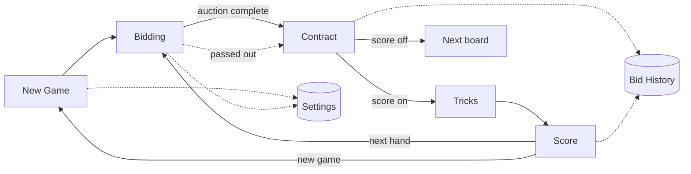
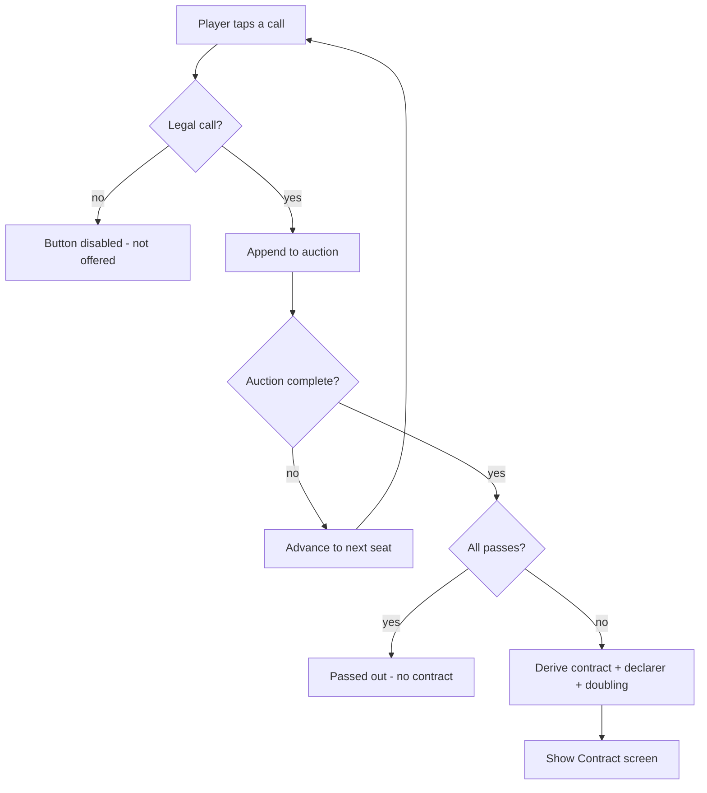
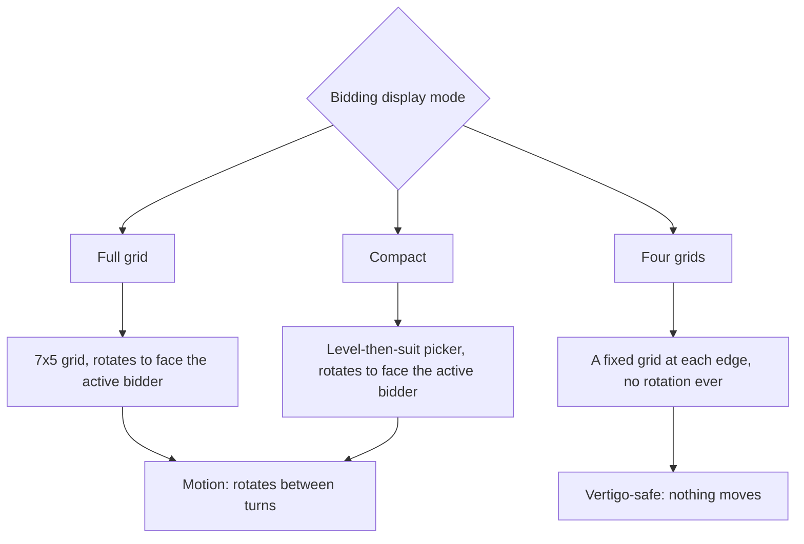
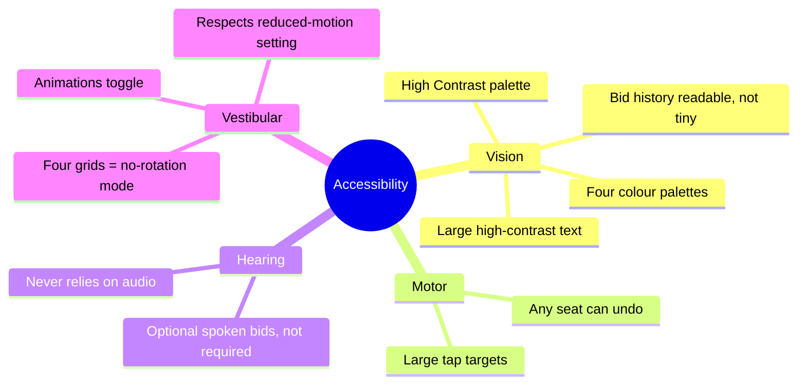
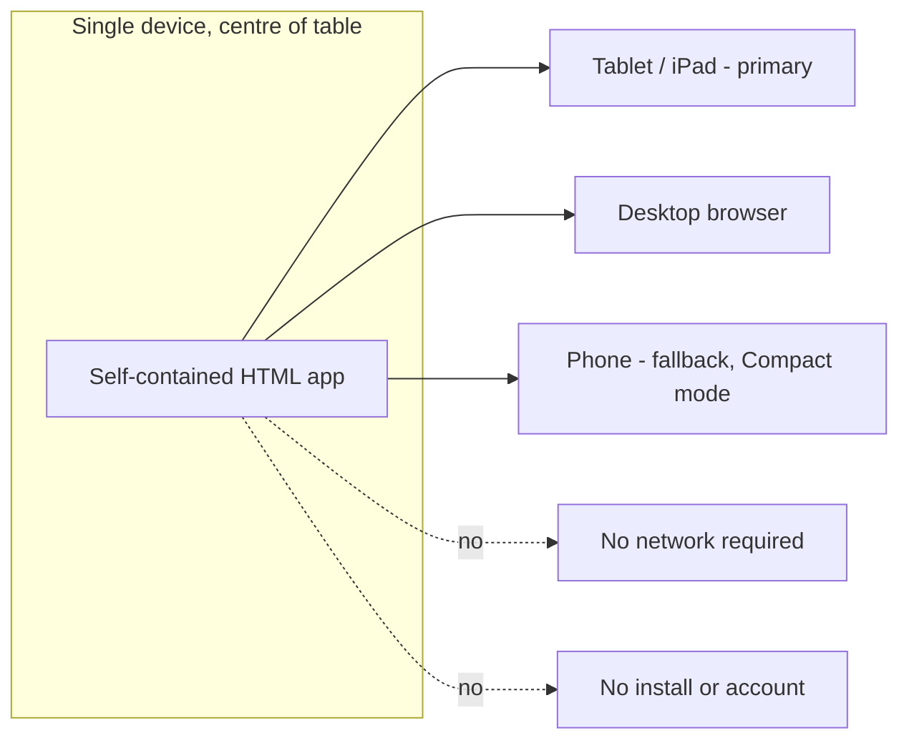

# Bridge Table Companion — Product Description & User Stories

A shared, table-centre bidding and scoring aid for in-person Bridge. One device sits in the middle of the table and serves up to four players seated on all four sides at once.

---

## 1. The problem

Social Bridge played at home rarely has the physical equipment a club takes for granted. Without bidding boxes, the auction lives in people's heads — and the moment one person calls a bid aloud for the table, three things go wrong:

- Players lose track of what's been bid, by whom, and in what order.
- One person ends up "running" the auction for everyone, which is slow and error-prone.
- Scoring duplicate Bridge by hand is fiddly, and disputes over who made what are common.

For players with vision impairment, arthritis, hearing loss, or vertigo, the usual workarounds (tiny scorecards, passing a phone around, calling bids aloud) are worse than inconvenient — they're exclusionary.

## 2. The solution, in one line

> A single device placed flat in the centre of the table that every player can read and operate from their own seat, handling the full auction and scoring with real Bridge rules — designed first for accessibility.

## 3. Who it's for

The product was shaped around a real table: a player, their brother, and their grandmother. That trio captures the core audience — **multi-generational, mixed-ability, casual-to-serious home players** who want the structure of club Bridge without the kit or the barriers.

## 4. Why it's different — the benefits angle

| Benefit | What it means at the table |
|---|---|
| **Everyone reads it from their own seat** | Content is rendered facing each of the four sides. Nobody has to crane, rotate the device, or ask "what was bid?" |
| **No single scorekeeper** | The device is the source of truth. Any player can act from their side; the auction can't drift. |
| **Accessibility is the default, not an add-on** | Large high-contrast text, big tap targets, four colour palettes, no reliance on sound, and a no-rotation mode for motion sensitivity. |
| **Real Bridge, enforced** | Only legal calls are offered. Doubles, redoubles, declarer, and duplicate scoring are derived automatically — no rules arguments. |
| **Responsive to the room** | Works best on a tablet centre-table, scales to fit the screen, and falls back gracefully to a phone. |
| **Zero setup** | No account, no network. Open in a browser and play; installable to the home screen for a fullscreen, offline, app-like experience. |

## 5. The experience, end to end

The app moves through five screens in a loop, with Settings and Bid History available throughout.

### New Game
Two choices set the tone for the session: whether to track vulnerability, and whether to calculate scores. Everything else is sensible defaults.

### Bidding
The heart of the product. The current bidder is highlighted, only legal calls are enabled, and each seat sees its own bid history. There are three ways to display the auction (see §6.2), including a no-rotation mode for players prone to vertigo.

### Contract
Once the auction completes (three passes after a bid, or four passes for a passed-out board), the device derives the contract and declarer automatically. A four-sided contract card shows the deal facing every edge, with role badges — Declarer, Dummy, Defender, Opening Lead — turned to face each player.

### Tricks & Score
A two-sided trick counter (readable and operable from both long sides of the table) records tricks won by North/South. Duplicate scoring is computed automatically, including doubling, vulnerability, slam bonuses, and undertrick penalties. The running score sheet is shown split so both sides of the table can read it, and any board's auction can be re-opened from its row.

## 6. Functional detail

### 6.1 Bridge engine (rules)

- **Legal-bid validation** — a call is only offered if it outranks the current highest bid. Suit/level ranking follows standard order (♣ < ♦ < ♥ < ♠ < NT).
- **Doubles & redoubles** — a double is offered only against an opponent's live contract bid; a redouble only by the doubled side. The doubling state resets when a new contract bid is made.
- **Auction completion** — closes after three consecutive passes following any bid, or four passes from the opening (passed out).
- **Declarer derivation** — the declarer is the first player of the winning partnership to have named the final strain.
- **Dealer & vulnerability rotation** — dealer rotates by board (N, E, S, W); vulnerability follows the standard 16-board cycle.
- **Undo** — the last call can be undone from any seat at any point in the auction.

### 6.2 Multi-orientation rendering

The defining technical feature: content is rendered to face whichever player needs it. Three bidding display modes serve different needs.

| Mode | How it works | Best for |
|---|---|---|
| **Full grid** | A complete 7×5 bidding grid that rotates to face the player whose turn it is. | Tablet/desktop, players who want every call visible at once. |
| **Compact** | A smaller two-step picker (choose level, then suit) that rotates to the active bidder. The only mode that fits a phone. | Phones, smaller screens. |
| **Four grids** | A fixed compact grid permanently at each of the four edges, each facing its player. Only the active player's grid is lit; the others dim. **Nothing rotates.** | Players with vertigo or motion sensitivity; fastest multi-player flow. |

In **Four grids** mode the layout is edge-pinned and auto-scales to fit the screen, so all four grids stay fully on-screen from a large tablet down to a phone, and no block is ever clipped as content grows. Each seat also shows its own bid-card strip, large enough to read across the table.

**Responsive by default.** The app adapts to the actual screen size — resizing the window or switching device reflows the layout automatically (only Compact is offered on a phone). The auto-rotate centre panel and the four-grids cluster scale to fill the available space without clipping. The rotating centre panel always turns the **shorter way** as play moves clockwise, so it never does a disorienting full spin, and South stays upright.

**Double-sided bid cards.** Each bid card shows its value in opposite corners (like a playing card), with a central suit pip, so a seat's bids can be read from across the table as well, not just by the owning player.

### 6.3 Accessibility features

- **Vision** — large type and controls throughout; four palettes (Felt Green, Navy Blue, High Contrast, Warm Parchment) switchable live, all meeting WCAG AA contrast; suits always carry a shape **and** a label, never colour alone, for colour-blind players.
- **Extra-large mode** — a single Settings toggle scales text, controls, and the bidding grid up across every screen, for low vision and limited dexterity. It works alongside any bidding layout (Compact gives the largest targets).
- **Keyboard & screen reader** — Settings and Bid History are focus-managed dialogs (focus moves in, Tab is trapped, Escape closes, focus returns); whose-turn and the derived contract are announced via live regions; pinch-zoom is never disabled.
- **Motor** — generous tap targets sized for arthritic hands; the undo control is reachable from every seat.
- **Hearing** — no information is ever conveyed by sound alone. Spoken bid announcements are an optional extra, off by default.
- **Vestibular** — an Animations toggle disables rotation and transitions; the Four grids mode removes rotation entirely; the app honours the operating system's "reduce motion" preference automatically.

### 6.4 Scoring

Full duplicate-Bridge scoring is computed automatically once the trick count is entered: contract trick values, the game/part-score bonus, small- and grand-slam bonuses, doubled and redoubled trick scores and insult bonuses, overtricks, and undertrick penalties — all adjusted for vulnerability. A running total is maintained across the session and shown on a dual-readable score sheet. (When "Track Vulnerability" is off, every board is scored non-vulnerable.)

### 6.6 Saving & portability

The game persists automatically to the device and **resumes after a reload or app restart**. A game can also be **exported to a JSON file and imported** on another device — a lightweight backup and transfer, since data otherwise lives only in the browser. The app installs to the home screen (PWA) for a fullscreen, offline, app-like experience.

### 6.5 Bid History

The full auction is always recoverable. From the Contract screen and from any row of the score sheet, a Bid History view shows the auction laid out as a four-column table. In Four grids mode, each seat's bid-card strip already provides per-seat history without opening a popup.

## 7. Platform & deployment

- **Primary target**: a tablet or iPad laid flat in the table centre — the true four-sided experience.
- **Desktop**: fully supported for development and play.
- **Phone**: a graceful fallback. It still sits centre-table, but some information is condensed and Full grid / Four grids are unavailable — only Compact fits a phone, and the app communicates this clearly.
- **Architecture**: a React + TypeScript PWA served as static files. No network or account to play; installable to the home screen and fully offline once loaded.

---

## 8. User stories

Grouped by player need. Each is phrased as *As a … I want … so that …* with acceptance criteria.

### Setup & session

**US-1 — Start a session quickly**
*As a host, I want to start a new game with one or two choices so that we can begin playing immediately.*
- New Game screen offers Track Vulnerability and Calculate Score toggles.
- A single Start Game action begins board 1 with the correct dealer and vulnerability.

**US-2 — Play multiple boards**
*As a player, I want consecutive boards to advance automatically so that dealer and vulnerability rotate correctly without manual setup.*
- Each new board increments the board number and rotates dealer (N→E→S→W).
- Vulnerability follows the standard 16-board cycle.

### Bidding

**US-3 — See whose turn it is**
*As a player, I want the device to clearly show whose turn it is so that the auction proceeds in order.*
- The active seat is visibly highlighted and labelled (e.g. "to bid").

**US-4 — Only make legal calls**
*As a player, I want illegal bids to be unavailable so that I never accidentally break the rules.*
- Calls that don't outrank the current bid are disabled.
- Double is offered only against a live opposing contract; redouble only by the doubled side.

**US-5 — Read the auction from my seat**
*As a player on any side of the table, I want to read the bidding without rotating the device so that I can follow along comfortably.*
- Content faces each seat (rotated, or fixed-per-edge in Four grids mode).
- Each seat sees its own bid history at a readable size.
- Bid cards show mirrored corner indices so a seat's bids can also be read from the opposite side.

**US-6 — Undo a mistake**
*As any player, I want to undo the last call so that a misclick can be corrected without restarting.*
- An undo control is reachable from every seat and removes the most recent call.

**US-7 — Choose how bidding is shown**
*As a player, I want to choose between Full grid, Compact, and Four grids so that the display suits our device and needs.*
- Three modes are selectable in Settings.
- Unavailable modes on the current device are disabled with a reason shown.

### Accessibility

**US-8 — Play without motion (vertigo)**
*As a player prone to vertigo, I want a mode where nothing rotates so that I can play without discomfort.*
- Four grids mode never rotates content.
- An Animations toggle disables transitions; the OS reduced-motion setting is honoured automatically.

**US-9 — See clearly (low vision)**
*As a player with low vision, I want large, high-contrast text and a high-contrast palette so that I can read every element.*
- Large type and controls throughout.
- A High Contrast palette is available and switches live.
- An Extra-large mode scales the entire interface up across all screens.

**US-10 — Distinguish suits without colour (colour-blind)**
*As a colour-blind player, I want suits identified by shape and label so that I never rely on colour alone.*
- Every suit shows its symbol and an accessible label.

**US-11 — Operate with limited dexterity (arthritis)**
*As a player with arthritis, I want large tap targets so that I can act without precise tapping.*
- Controls meet a generous minimum target size.

**US-12 — Play without sound (hearing loss)**
*As a player with hearing loss, I want no information conveyed by sound so that I miss nothing.*
- All state is visible. Spoken bids are optional and off by default.

### Contract, tricks & scoring

**US-13 — Know the contract and my role**
*As a player, I want the contract, declarer, and my role shown facing me so that play can begin without confusion.*
- A four-sided contract card shows the contract to every edge.
- Role badges (Declarer, Dummy, Defender, Opening Lead) face each seat.

**US-14 — Record tricks from either side**
*As a player on either long side, I want to enter the trick count from my side so that whoever is closest can record it.*
- A two-sided trick counter is readable and operable from both sides, linked to one value.

**US-15 — Get the score automatically**
*As a player, I want duplicate scoring computed for me so that we avoid manual errors and disputes.*
- Scoring accounts for level, strain, doubling, vulnerability, slams, overtricks, and penalties.
- A running total is maintained and shown to both sides.

**US-16 — Review any auction**
*As a player, I want to reopen the bidding for the current or a past board so that we can settle questions about how the contract was reached.*
- Bid History is reachable from the Contract screen and from each score row.

### Platform

**US-17 — Use it on the table tablet**
*As a host, I want the four-sided experience on a tablet centre-table so that all four players are served equally.*
- The full layout renders on tablet/desktop and scales to fit the screen.

**US-18 — Fall back to a phone**
*As a host without a tablet, I want the app to still work on a phone so that we can play anyway.*
- Compact mode fits a phone; unsupported modes are disabled with a clear reason.
- The app communicates that some information is condensed on a phone.
- The device form factor is detected automatically and the layout reflows as the screen size changes (no manual switch needed).

**US-19 — Just open it**
*As a host, I want no install, account, or network so that setup is instant anywhere.*
- The app is a single self-contained file that runs offline.

---

## 9. Out of scope (for now)

- Recording the cards in each hand or play of individual tricks (the app records the *auction* and *trick count*, not card-by-card play).
- Online/remote play — this is a single shared device, in person.
- Player accounts, cloud sync, or cross-session history beyond the current game.
